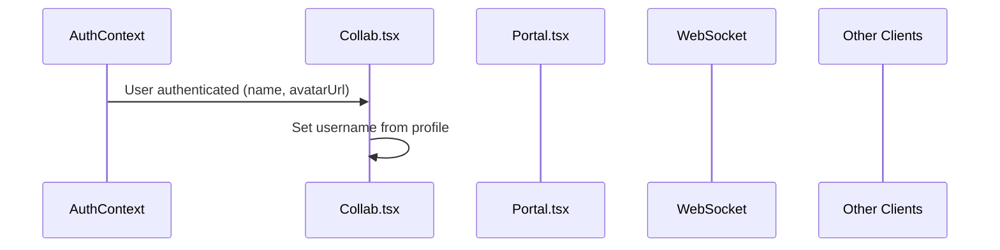

# Integrate

Authenticated User Profile into Collaboration

## Overview

When a user is signed in, the collaboration system should automatically use their profile name and avatar instead of a random name or localStorage value. This requires changes to:

1. Initialize username from user profile when authenticated
2. Add `avatarUrl` to socket broadcast messages
3. Update collaborator state with received avatar URLs

## Data Flow

