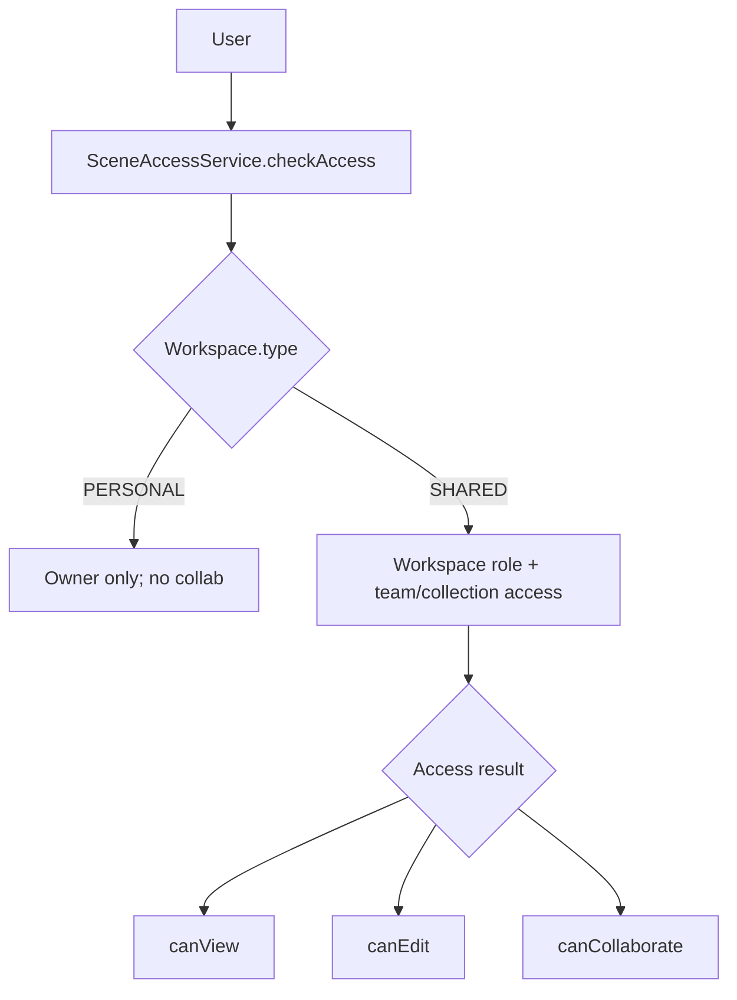

# Plan: Collaboration Permissions Backend (Part A)

## Scope

Implement Phase 1 & 2 from `docs/COLLABORATION_IMPLEMENTATION_PLAN.md` in `backend/` on branch `feature/collab-permissions-backend`: schema updates, permission enforcement, scene access service, new endpoints, and copy/move workspace operations. No frontend changes.

## Steps

1) **Prisma schema updates** (`backend/prisma/schema.prisma`)

- Add `isSuperAdmin` to `User` (default false).
- Introduce `WorkspaceType` enum and `Workspace.type` with default `PERSONAL`.
- Replace `TeamCollection.canWrite` with `CollectionAccessLevel` enum and `accessLevel` field (default `EDIT`).
- Add `collaborationEnabled` (default true) and `roomKeyEncrypted` to `Scene`.
- Generate migration (`npx prisma migrate dev --name add_workspace_types_and_collab`).

2) **Workspace service enforcement** (`backend/src/workspaces/workspaces.service.ts`)

- Block invites and team creation when `Workspace.type === PERSONAL`.
- Set `type: PERSONAL` in default workspace creation; add `createSharedWorkspace` that sets `type: SHARED` with creator as ADMIN.
- Ensure role/membership helpers align with new workspace types.

3) **Scene access service** (`backend/src/workspace/scene-access.service.ts` new)

- Implement `checkAccess(sceneId, userId)` returning `{ canView, canEdit, canCollaborate }` following workspace → collection/team → scene rules (personal: owner-only, no collaboration; shared: role/admin, private owner, team access via `accessLevel`).
- Provide helper to fetch user team IDs in workspace.

4) **Scene endpoints adjustments** (`backend/src/workspace/workspace-scenes.controller.ts`)

- Add `GET /workspace/by-slug/:slug/scenes/:id` to load by workspace slug with `SceneAccessService` check.
- Update `POST /scenes/:id/collaborate` to require `canCollaborate`, generate/store `roomId`, encrypt & persist `roomKeyEncrypted`, respect `collaborationEnabled`.
- Add `GET /scenes/:id/collaborate` to return room credentials when authorized.
- Wire `SceneAccessService` for reads/edits decisions; ensure responses include permission flags as needed.

5) **Copy/Move collection endpoints** (`backend/src/workspace/workspace-scenes.controller.ts` or dedicated controller)

- Implement `POST /collections/:id/copy-to-workspace` and `POST /collections/:id/move-to-workspace` with permission checks (source write + target write/admin), duplicating/moving collections and scenes across workspaces while respecting workspace types.

6) **Module wiring & guards**

- Export/register `SceneAccessService` in relevant module(s) so controllers can inject.
- Adjust DTOs/types if needed for new enums and fields.

7) **Verification**

- Run `npm run build` and `npm run lint` after changes; ensure migration applied.

## Permissions Flow (reference)

