# CSS Hide/Show Architecture Fix

## Problem Summary

When `appMode` changes between "dashboard" and "canvas", React completely unmounts one component tree and mounts another. This causes Excalidraw to lose its state, and any data loaded via `updateScene()` is lost when the component remounts.

## Solution

Always render both the dashboard content and Excalidraw, using CSS `display: none` to hide the inactive view. This eliminates the unmount/remount cycle entirely.

## Architecture Change

```mermaid
flowchart TB
    subgraph current [Current Architecture - Buggy]
        A1[appMode = dashboard] --> B1[Unmount Excalidraw]
        B1 --> C1[Mount Dashboard]
        C1 --> D1[appMode = canvas]
        D1 --> E1[Unmount Dashboard]
        E1 --> F1[Mount Excalidraw - STATE LOST]
    end
    
    subgraph new [New Architecture - Fixed]
        A2[appMode = dashboard] --> B2[Hide Excalidraw via CSS]
        B2 --> C2[Show Dashboard]
        C2 --> D2[appMode = canvas]
        D2 --> E2[Hide Dashboard via CSS]
        E2 --> F2[Show Excalidraw - STATE PRESERVED]
    end
```




## Implementation

### File: [frontend/excalidraw-app/App.tsx](frontend/excalidraw-app/App.tsx)

**Change 1: Remove early return for dashboard mode (lines 2563-2597)**Delete the entire `if (appMode === "dashboard" && !isLegacyMode)` block that returns early.**Change 2: Restructure the main return to render both views**Replace the current return statement with a structure that always renders both:

```tsx
return (
  <div
    style={{ height: "100%" }}
    className={clsx("excalidraw-app", {
      "is-collaborating": isCollaborating,
      "workspace-sidebar-open": workspaceSidebarOpen,
    })}
  >
    {/* Workspace Sidebar - shared between both modes */}
    {!isLegacyMode && (
      <WorkspaceSidebar
        isOpen={workspaceSidebarOpen}
        onClose={() => setWorkspaceSidebarOpen(false)}
        onNewScene={handleNewScene}
        currentSceneId={currentSceneId}
        onWorkspaceChange={(workspace, privateColId) => {
          setCurrentWorkspace(workspace);
          setCurrentWorkspaceSlug(workspace.slug);
          setPrivateCollectionId(privateColId);
        }}
      />
    )}

    {/* Dashboard Content - hidden when in canvas mode */}
    {!isLegacyMode && (
      <div 
        className="excalidraw-app__main"
        style={{ display: appMode === "dashboard" ? "block" : "none" }}
      >
        <WorkspaceMainContent
          workspace={currentWorkspace}
          collections={collections}
          isAdmin={isWorkspaceAdmin}
          onNewScene={handleNewScene}
        />
      </div>
    )}

    {/* Canvas Content - hidden when in dashboard mode */}
    <div 
      className="excalidraw-app__main excalidraw-app__canvas"
      style={{ display: appMode === "canvas" || isLegacyMode ? "block" : "none" }}
    >
      {/* Loading spinner overlay when switching scenes */}
      {isLoadingScene && (
        <div className="excalidraw-app__loading-overlay">
          <div className="excalidraw-app__spinner" />
        </div>
      )}
      
      <Excalidraw
        excalidrawAPI={excalidrawRefCallback}
        onChange={onChange}
        initialData={initialStatePromiseRef.current.promise}
        isCollaborating={isCollaborating}
        onPointerUpdate={collabAPI?.onPointerUpdate}
        handleKeyboardGlobally={appMode === "canvas"}
        autoFocus={appMode === "canvas"}
        // ... rest of props unchanged
      >
        {/* Children unchanged */}
      </Excalidraw>
    </div>
  </div>
);
```

**Change 3: Disable keyboard handling when hidden**Update the Excalidraw props to conditionally disable keyboard handling:

```tsx
handleKeyboardGlobally={appMode === "canvas"}
autoFocus={appMode === "canvas"}
```


### File: [frontend/excalidraw-app/index.scss](frontend/excalidraw-app/index.scss) (or App.scss if exists)

Add styles for the loading overlay:

```scss
.excalidraw-app__loading-overlay {
  position: absolute;
  top: 0;
  left: 0;
  right: 0;
  bottom: 0;
  background: rgba(255, 255, 255, 0.8);
  display: flex;
  align-items: center;
  justify-content: center;
  z-index: 100;
}

.excalidraw.theme--dark .excalidraw-app__loading-overlay {
  background: rgba(35, 35, 41, 0.8);
}

.excalidraw-app__canvas {
  position: relative;
}
```


## Simplifications

With this change, we can **remove** the following complexity:

1. **Remove `sceneDataLoaded` state** - No longer needed since Excalidraw is always mounted
2. **Simplify `loadSceneFromUrl()`** - No need to reset `initialStatePromiseRef` for subsequent loads; just use `updateScene()` directly
3. **Remove the loading spinner early return** (lines ~2520-2559) - Replace with the overlay inside the canvas div

## Testing Checklist

After implementation, verify these scenarios work:

1. Create scene with drawings -> Save -> Go to dashboard -> Click scene -> Drawings visible
2. Switch between multiple scenes rapidly -> All show correct data
3. Browser back/forward -> Correct scene displayed