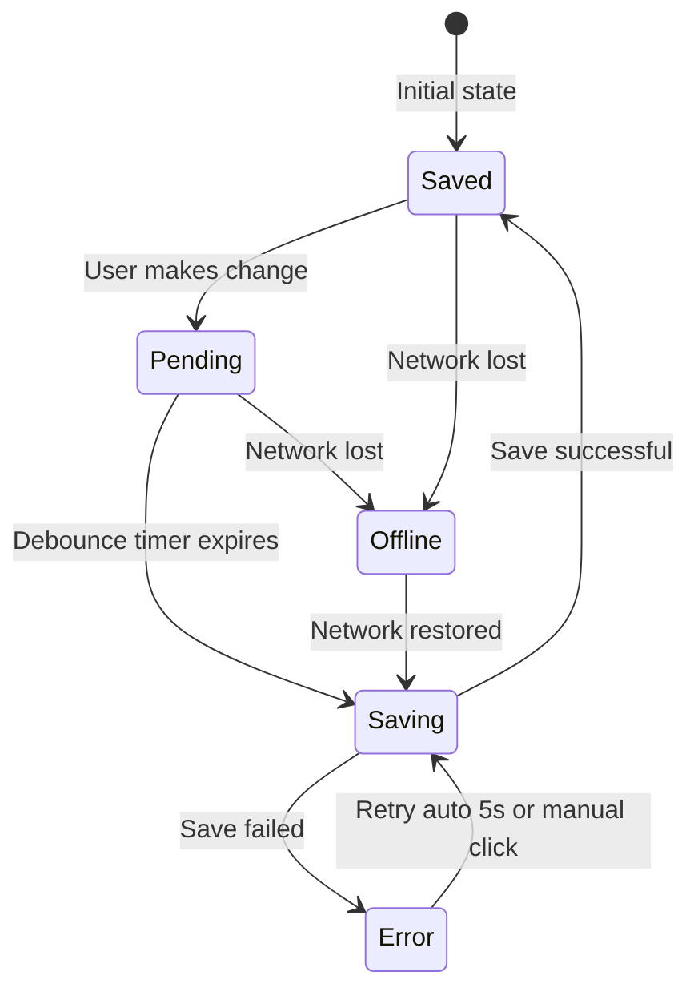

# Improved Autosave Status Indicator

## Overview

Replace the current toast-based autosave notification with a persistent status indicator in the top-right UI area, showing:

- Editable scene title
- Save status icon + text (saved/saving/pending/error/offline)
- Relative timestamp on hover



## Files to Create/Modify

### New Component

- `frontend/excalidraw-app/components/SaveStatusIndicator/SaveStatusIndicator.tsx` - Main component
- `frontend/excalidraw-app/components/SaveStatusIndicator/SaveStatusIndicator.scss` - Styles
- `frontend/excalidraw-app/components/SaveStatusIndicator/index.ts` - Export

### Modified Files

- [`frontend/excalidraw-app/App.tsx`](frontend/excalidraw-app/App.tsx):
- Add state machine for save status
- Add timing constants
- Update `onChange` handler to set pending state
- Update autosave effect with new states
- Add network event listeners
- Add critical save before navigation
- Render SaveStatusIndicator in `renderTopRightUI()` **before** collaboration button
- [`frontend/packages/excalidraw/locales/en.json`](frontend/packages/excalidraw/locales/en.json) - Add translation keys
- [`frontend/packages/excalidraw/locales/ru-RU.json`](frontend/packages/excalidraw/locales/ru-RU.json) - Add Russian translations

## Implementation Details

### 1. Save Status State Machine and Constants

Add to `App.tsx`:

```typescript
type SaveStatus = "saved" | "saving" | "pending" | "error" | "offline";

// Timing constants
const AUTOSAVE_DEBOUNCE_MS = 2000;      // 2 seconds after last change
const AUTOSAVE_RETRY_DELAY_MS = 5000;   // 5 seconds on error (single retry)
const BACKUP_SAVE_INTERVAL_MS = 30000;  // 30 seconds safety net

const [saveStatus, setSaveStatus] = useState<SaveStatus>("saved");
const [lastSavedTime, setLastSavedTime] = useState<Date | null>(null);
const [isOnline, setIsOnline] = useState(navigator.onLine);
const saveTimerRef = useRef<ReturnType<typeof setTimeout> | null>(null);
const retryCountRef = useRef<number>(0);
```

**Note:** We already have `lastSavedDataRef` for change detection via string comparison - no need for separate hash function.

### 2. Scene Title Editing Behavior

The title is editable inline (single-click to edit, like Google Docs):

- **On blur or Enter**: Save new title via `updateSceneApi(sceneId, { title })` - separate from autosave
- **On Escape**: Revert to previous title, cancel edit mode
- **During save**: Show subtle loading state on title input
- **Keyboard events**: Must call `e.stopPropagation()` on `onKeyDown` and `onKeyUp` to prevent Excalidraw shortcuts

Title changes do NOT trigger full scene data autosave (they use a separate API call).

### 3. SaveStatusIndicator Component

Key features:

- Shows scene title (editable inline with click-to-edit)
- Shows status icon + text based on state
- Shows relative time on hover ("2 min ago", "just now")
- Clickable error state for retry
- Keyboard event propagation stopped for title editing

Visual layout:

```javascript
[Scene Title] | [Icon] Status Text (time on hover)
```


### 4. Updated Auto-save Flow

1. `onChange` -> set `saveStatus = "pending"` (if currentSceneId exists)
2. After 2s debounce -> set `saveStatus = "saving"`, call API
3. **Before API call**: Compare with `lastSavedDataRef.current` - skip if unchanged (already implemented)
4. On success -> set `saveStatus = "saved"`, update `lastSavedTime`, reset `retryCountRef`
5. On error:

- If `retryCountRef < 1`: set `saveStatus = "error"`, schedule retry after 5s, increment retry count
- If `retryCountRef >= 1`: set `saveStatus = "error"`, wait for user click or next change

6. Network offline -> set `saveStatus = "offline"`
7. Network online + was offline -> trigger save immediately

### 5. Critical Save Before Navigation

Add logic to save immediately (no debounce) when:

- Switching scenes (in `navigateToSceneAtom` flow)
- Going to dashboard (in `navigateToDashboardAtom` flow)
- `beforeunload` event with pending/saving status
```typescript
// Add to existing beforeunload handler
if (saveStatus === "saving" || saveStatus === "pending") {
  e.preventDefault();
  e.returnValue = t("saveStatus.unsavedWarning");
  // Trigger immediate save in background
  saveSceneImmediately();
}
```


### 6. Offline Detection

```typescript
useEffect(() => {
  const handleOnline = () => {
    setIsOnline(true);
    // If we were offline with pending changes, trigger save
    if (saveStatus === "offline" && hasUnsavedChanges) {
      performSave();
    }
  };
  const handleOffline = () => {
    setIsOnline(false);
    if (saveStatus === "pending" || saveStatus === "saving") {
      setSaveStatus("offline");
    }
  };
  window.addEventListener("online", handleOnline);
  window.addEventListener("offline", handleOffline);
  return () => {
    window.removeEventListener("online", handleOnline);
    window.removeEventListener("offline", handleOffline);
  };
}, [saveStatus, hasUnsavedChanges]);
```


### 7. Translation Keys

```json
{
  "saveStatus": {
    "saved": "Saved",
    "saving": "Saving...",
    "pending": "Unsaved changes",
    "pendingShort": "Unsaved",
    "error": "Save failed",
    "offline": "Offline",
    "justNow": "just now",
    "secondsAgo": "{{count}} sec ago",
    "minutesAgo": "{{count}} min ago",
    "hoursAgo": "{{count}} h ago",
    "clickToRetry": "Click to retry",
    "unsavedWarning": "You have unsaved changes. Are you sure you want to leave?"
  }
}
```


## UI/UX Details

### Status Colors

| State | Color | Icon ||-------|-------|------|| saved | Green (#10b981) | Checkmark circle || saving | Gray (#6b7280) | Spinning loader || pending | Gray (#9ca3af) | Pulsing dot || error | Amber (#f59e0b) | Warning triangle || offline | Red (#ef4444) | Wifi-off |

### Styling

- Font: var(--ui-font)
- Font size: 13px for status, 14px for title
- Gap between title and status: 12px (with separator dot)
- Hover on status shows timestamp
- Hover on error shows "Click to retry" tooltip
- Dark mode compatible via CSS variables
- Title input focus ring: 2px outline matching Excalidraw style

### Accessibility

- Save status container has `role="status"` and `aria-live="polite"`
- Error state has `role="alert"` for screen reader announcement
- Title input has `aria-label={t("saveStatus.sceneTitle")}`
- All icons have `aria-hidden="true"` with text labels for screen readers

### Mobile / Narrow Screens

On mobile (`isMobile` parameter from `renderTopRightUI`):

- Hide "changes" in "Unsaved changes" -> just show "Unsaved" (`pendingShort`)
- Hide relative timestamp completely
- Truncate scene title with ellipsis after ~15 characters
```scss
.save-status-indicator--mobile {
  .save-status__text { font-size: 12px; }
  .save-status__time { display: none; }
  .scene-title__input { max-width: 120px; }
}
```


### Interaction

- Click on title -> inline edit mode (input replaces text)
- Enter or blur -> save title via API, exit edit mode
- Escape -> revert to previous title, exit edit mode
- Click on error status -> immediate retry
- Title changes call `updateSceneApi()` separately from autosave

## Visibility Rules

The SaveStatusIndicator should only appear when:

- User is authenticated
- A workspace scene is open (`currentSceneId` is set)
- Not in legacy/anonymous mode (`!isLegacyMode`)