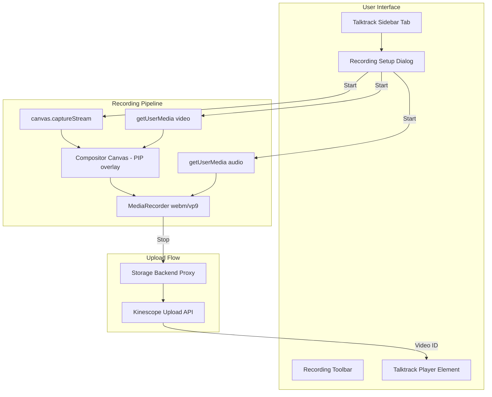

# Talktrack Recording Feature (Miro-style)

Record canvas walkthroughs with camera PIP and mic, upload to Kinescope, embed playback on the board.

## Architecture




## Files to Create

### New Files

- `excalidraw-app/components/Talktrack/` - Main feature folder
- `index.ts` - Exports
- `TalktrackPanel.tsx` - Sidebar panel with recordings list (like Miro)
- `TalktrackPanel.scss` - Styles
- `TalktrackSetupDialog.tsx` - Camera/mic selection dialog before recording
- `TalktrackToolbar.tsx` - Floating toolbar during recording (delete/restart/pause/timer/stop)
- `TalktrackToolbar.scss` - Toolbar styles
- `TalktrackRecorder.ts` - Core recording logic (canvas + camera PIP + mic compositing)
- `kinescopeApi.ts` - Upload helper using Kinescope REST API
- `packages/excalidraw/element/embeddable/talktrack.ts` - Talktrack element type for board embedding

### Files to Modify

- [excalidraw-app/components/AppSidebar.tsx](excalidraw-app/components/AppSidebar.tsx) - Add Talktrack tab trigger
- [packages/excalidraw/components/icons.tsx](packages/excalidraw/components/icons.tsx) - Add video/recording icon
- [packages/excalidraw/locales/en.json](packages/excalidraw/locales/en.json) - English translations
- [packages/excalidraw/locales/ru-RU.json](packages/excalidraw/locales/ru-RU.json) - Russian translations
- [docker-compose.yml](docker-compose.yml) - Add VITE_APP_KINESCOPE_API_KEY env var
- [env.example](env.example) - Document Kinescope configuration

## Recording Pipeline Details

1. **Setup Dialog** (like Miro screenshot 2):

- Camera preview with avatar fallback
- Camera on/off toggle
- Mic on/off toggle  
- Video source dropdown (None, or available cameras)
- Audio source dropdown (available mics)
- "Start recording" / "Go back to library" buttons

2. **Canvas Capture**:

- Get the static canvas element: `document.querySelector('.excalidraw__canvas.static')`
- Call `canvas.captureStream(30)` for 30fps

3. **Camera PIP Compositing**:

- Create hidden compositor canvas matching board dimensions
- In `requestAnimationFrame` loop:
    - Draw board canvas frame
    - Draw camera feed as circular PIP in bottom-right corner (like Miro)
- Call `compositorCanvas.captureStream(30)`

4. **Audio**:

- `getUserMedia({ audio: { deviceId } })` for mic
- Add audio track to compositor stream

5. **MediaRecorder**:

- Preferred: `video/webm;codecs=vp9,opus`
- Fallback: `video/webm` or browser default
- Collect chunks in `ondataavailable`

6. **Floating Toolbar** (like Miro screenshot 3):

- Position: top-right corner of canvas
- Controls: Delete (trash), Restart (arrow), Pause, Timer display, STOP button
- Show camera preview bubble if camera enabled

## Kinescope Integration

### Environment Variables

```bash
# env.example
KINESCOPE_API_KEY=your_kinescope_api_key
KINESCOPE_PROJECT_ID=your_project_id  # Parent folder for uploads
```


### Upload Flow

Since we can't expose the API key to the client, route uploads through the storage backend:

1. Client sends recording blob to storage backend: `POST /api/v2/talktrack/upload`
2. Storage backend proxies to Kinescope: `POST https://uploader.kinescope.io/v2/video`
3. Returns Kinescope video ID to client
4. Client stores video ID in board state / creates TalktrackElement

### Playback

Use `@kinescope/player-iframe-api-loader` to embed player:

```typescript
import * as iframeApiLoader from '@kinescope/player-iframe-api-loader';

const factory = await iframeApiLoader.load();
const player = await factory.create('player-container', {
  videoId: recording.kinescopeId,
  // ... player options
});
```


## UI Flow (matching Miro)

1. User clicks Video icon in sidebar -> opens Talktrack panel
2. Panel shows:

- List of existing recordings with thumbnails, titles, duration, date
- "Record Talktrack" button at bottom

3. Click "Record Talktrack" -> Setup dialog opens
4. Configure camera/mic -> Click "Start recording"
5. 3-2-1 countdown -> Recording starts
6. Floating toolbar appears in top-right during recording
7. Click "STOP" -> Recording ends, upload begins
8. After upload: recording appears in panel list
9. Click recording -> can "Add to board" to embed player element

## Dependencies