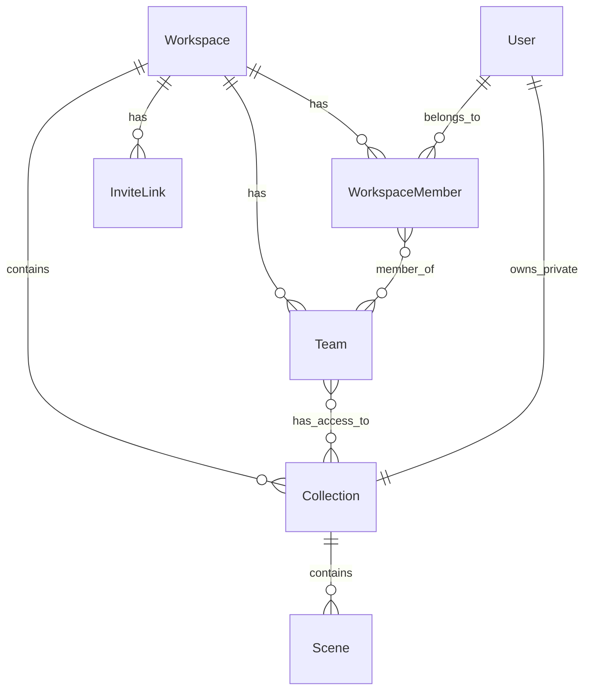

# Roles, Teams & Collections Implementation

## Overview

This plan implements a complete workspace-level access control system:

- **Roles**: Admin, Member, Viewer with different permission levels
- **Collections**: Folders for organizing scenes with access control
- **Teams**: Named groups that grant collection access to multiple users

## Architecture




## Data Model Changes

Extend [`backend/prisma/schema.prisma`](backend/prisma/schema.prisma) with:

```prisma
enum WorkspaceRole {
  ADMIN
  MEMBER
  VIEWER
}

model Workspace {
  id          String   @id @default(cuid())
  name        String
  slug        String   @unique
  avatarUrl   String?
  createdAt   DateTime @default(now())
  updatedAt   DateTime @updatedAt
  
  members     WorkspaceMember[]
  collections Collection[]
  teams       Team[]
  inviteLinks InviteLink[]
}

model WorkspaceMember {
  id          String        @id @default(cuid())
  role        WorkspaceRole @default(MEMBER)
  workspaceId String
  workspace   Workspace     @relation(...)
  userId      String
  user        User          @relation(...)
  teams       TeamMember[]
  createdAt   DateTime      @default(now())
  
  @@unique([workspaceId, userId])
}

model Team {
  id          String   @id @default(cuid())
  name        String
  color       String   // Hex color
  workspaceId String
  workspace   Workspace @relation(...)
  members     TeamMember[]
  collections TeamCollection[]
  createdAt   DateTime @default(now())
}

model TeamMember {
  teamId   String
  team     Team   @relation(...)
  memberId String
  member   WorkspaceMember @relation(...)
  @@id([teamId, memberId])
}

model TeamCollection {
  teamId       String
  team         Team       @relation(...)
  collectionId String
  collection   Collection @relation(...)
  canWrite     Boolean    @default(true)
  @@id([teamId, collectionId])
}

model InviteLink {
  id          String        @id @default(cuid())
  code        String        @unique
  role        WorkspaceRole @default(MEMBER)
  workspaceId String
  workspace   Workspace     @relation(...)
  expiresAt   DateTime?
  maxUses     Int?
  uses        Int           @default(0)
  createdAt   DateTime      @default(now())
}
```

Update existing `Collection` model to add:

- `workspaceId` (required, replaces user-only ownership)
- `isPrivate` boolean (true = only owner can see)
- `icon` string (emoji or icon name)
- Relation to `TeamCollection` for team access

## Backend Implementation

### New Modules

| Module | Location | Purpose ||--------|----------|---------|| Workspaces | [`backend/src/workspaces/`](backend/src/workspaces/) | CRUD for workspaces, member management || Teams | [`backend/src/teams/`](backend/src/teams/) | Team CRUD, member/collection assignment || Collections | [`backend/src/collections/`](backend/src/collections/) | Collection CRUD with access control |

### Key API Endpoints

**Workspaces:**

- `GET /api/v2/workspaces` - List user's workspaces
- `POST /api/v2/workspaces` - Create workspace (user becomes admin)
- `GET /api/v2/workspaces/:id/members` - List members
- `POST /api/v2/workspaces/:id/members/invite` - Invite by email
- `POST /api/v2/workspaces/:id/invite-links` - Create invite link
- `PUT /api/v2/workspaces/:id/members/:memberId` - Change role

**Teams:**

- `GET /api/v2/workspaces/:id/teams` - List teams
- `POST /api/v2/workspaces/:id/teams` - Create team (admin only)
- `PUT /api/v2/teams/:id` - Update team
- `DELETE /api/v2/teams/:id` - Delete team

**Collections:**

- `GET /api/v2/workspaces/:id/collections` - List accessible collections
- `POST /api/v2/workspaces/:id/collections` - Create collection
- `PUT /api/v2/collections/:id` - Update collection
- `DELETE /api/v2/collections/:id` - Delete collection

### Permission Guard

Create a reusable guard at [`backend/src/workspaces/workspace-role.guard.ts`](backend/src/workspaces/workspace-role.guard.ts):

```typescript
@Injectable()
export class WorkspaceRoleGuard implements CanActivate {
  // Checks user has required role in workspace
  // Extracts workspaceId from route params or body
}

// Usage: @UseGuards(WorkspaceRoleGuard)
//        @RequireRole(WorkspaceRole.ADMIN)
```


### Access Control Logic

```typescript
// Collection visibility rules:
function canSeeCollection(user, collection, workspace) {
  // 1. Workspace admin sees everything
  if (isAdmin(user, workspace)) return true;
  
  // 2. Private collection - only owner
  if (collection.isPrivate) return collection.userId === user.id;
  
  // 3. Team access - user is in a team linked to collection
  return userTeamsHaveAccess(user, collection);
}
```


## Frontend Implementation

### New Components

Create [`frontend/excalidraw-app/components/WorkspaceSettings/`](frontend/excalidraw-app/components/WorkspaceSettings/):| Component | Purpose ||-----------|---------|| `WorkspaceSettingsDialog.tsx` | Main settings modal with tabs || `MembersTab.tsx` | Member list, invite, role management || `TeamsCollectionsTab.tsx` | Teams and collections management || `CreateTeamDialog.tsx` | Team creation modal || `CreateCollectionDialog.tsx` | Collection creation modal || `InviteUserDialog.tsx` | Email invite modal || `TeamCard.tsx` | Team display with edit/delete || `CollectionItem.tsx` | Collection row in sidebar |

### Sidebar Updates

Modify [`frontend/excalidraw-app/components/Workspace/WorkspaceSidebar.tsx`](frontend/excalidraw-app/components/Workspace/WorkspaceSidebar.tsx):

- Add workspace selector dropdown at top
- Add "Collections" section with filterable list
- Add "+" button for creating collections
- Add "Workspace settings" and "Team members" navigation items
- Filter scenes by selected collection
- Show only collections user has access to

### API Client Extensions

Extend [`frontend/excalidraw-app/auth/workspaceApi.ts`](frontend/excalidraw-app/auth/workspaceApi.ts) with:

```typescript
// Workspace API
export async function listWorkspaces(): Promise<Workspace[]>
export async function createWorkspace(data): Promise<Workspace>
export async function getWorkspaceMembers(id): Promise<Member[]>
export async function inviteToWorkspace(id, email, role): Promise<void>
export async function updateMemberRole(id, memberId, role): Promise<void>

// Teams API
export async function listTeams(workspaceId): Promise<Team[]>
export async function createTeam(workspaceId, data): Promise<Team>
export async function updateTeam(teamId, data): Promise<Team>
export async function deleteTeam(teamId): Promise<void>

// Collections API
export async function listCollections(workspaceId): Promise<Collection[]>
export async function createCollection(workspaceId, data): Promise<Collection>
export async function updateCollection(id, data): Promise<Collection>
export async function deleteCollection(id): Promise<void>
```


### State Management

Add Jotai atoms for workspace state:

```typescript
export const currentWorkspaceAtom = atom<Workspace | null>(null);
export const workspaceMembersAtom = atom<Member[]>([]);
export const workspaceTeamsAtom = atom<Team[]>([]);
export const workspaceCollectionsAtom = atom<Collection[]>([]);
export const currentUserRoleAtom = atom<WorkspaceRole | null>(null);
```


### Translation Keys

Add to [`frontend/packages/excalidraw/locales/en.json`](frontend/packages/excalidraw/locales/en.json) and `ru-RU.json`:

```json
{
  "workspace": {
    "settings": "Workspace settings",
    "members": "Members",
    "teamsCollections": "Teams & Collections",
    "inviteUser": "Invite user",
    "createInviteLink": "Create invite link",
    "createTeam": "Create team",
    "createCollection": "Create collection",
    "roles": {
      "admin": "Admin",
      "member": "Member",
      "viewer": "Viewer"
    }
  }
}
```


## Migration Strategy

1. Create new tables with migration
2. Auto-create a "Personal" workspace for each existing user
3. Move existing user's collections and scenes to their personal workspace
4. Set existing users as ADMIN of their personal workspace

## Security Considerations

- All collection/scene queries filter by workspace membership
- Team/collection management requires ADMIN role
- Invite links have optional expiry and usage limits
- Private collections are strictly owner-only (not even admins can see content)

## Files to Create/Modify

**Backend (new files):**

- `backend/src/workspaces/workspaces.module.ts`
- `backend/src/workspaces/workspaces.controller.ts`
- `backend/src/workspaces/workspaces.service.ts`
- `backend/src/workspaces/workspace-role.guard.ts`
- `backend/src/teams/teams.module.ts`
- `backend/src/teams/teams.controller.ts`
- `backend/src/teams/teams.service.ts`
- `backend/src/collections/collections.module.ts`
- `backend/src/collections/collections.controller.ts`
- `backend/src/collections/collections.service.ts`

**Backend (modify):**

- `backend/prisma/schema.prisma` - Add new models
- `backend/src/app.module.ts` - Import new modules
- `backend/src/workspace/workspace-scenes.controller.ts` - Add collection/permission filters

**Frontend (new files):**

- `frontend/excalidraw-app/components/WorkspaceSettings/` (all components)
- `frontend/excalidraw-app/auth/teamsApi.ts`
- `frontend/excalidraw-app/auth/collectionsApi.ts`

**Frontend (modify):**

- `frontend/excalidraw-app/auth/workspaceApi.ts` - Add workspace APIs
- `frontend/excalidraw-app/components/Workspace/WorkspaceSidebar.tsx` - New layout