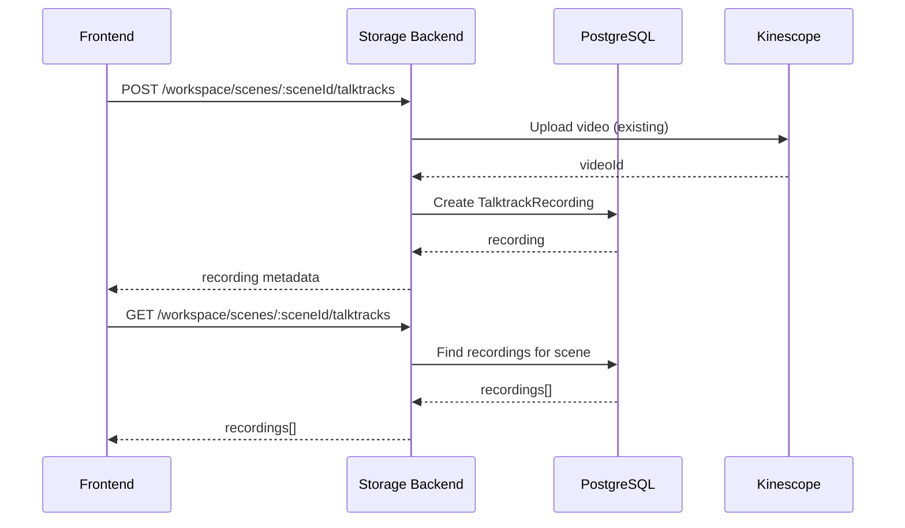

# Scene-Specific Talktrack Recording Storage

## Current State

Recordings are stored in browser localStorage (`astradraw_talktrack_recordings` key) with this structure:

```typescript
interface TalktrackRecording {
  id: string;
  title: string;
  kinescopeVideoId: string;
  duration: number;
  createdAt: string;
  thumbnailUrl?: string;
  processingStatus?: "uploading" | "processing" | "ready" | "error";
}
```

**Problems:** Not user-specific, not scene-specific, not synced across devices, not shareable.

## Architecture




## Implementation

### 1. Database Schema (Prisma)

Add `TalktrackRecording` model to [`excalidraw-storage-backend/prisma/schema.prisma`](excalidraw-storage-backend/prisma/schema.prisma):

```prisma
model TalktrackRecording {
  id                String   @id @default(cuid())
  title             String
  kinescopeVideoId  String   @unique
  duration          Int      // seconds
  processingStatus  String   @default("processing") // uploading, processing, ready, error
  
  // Relations
  sceneId           String
  scene             Scene    @relation(fields: [sceneId], references: [id], onDelete: Cascade)
  userId            String
  user              User     @relation(fields: [userId], references: [id], onDelete: Cascade)
  
  createdAt         DateTime @default(now())
  updatedAt         DateTime @updatedAt

  @@index([sceneId])
  @@index([userId])
  @@map("talktrack_recordings")
}
```

Update `Scene` and `User` models to add the relation.

### 2. Backend API Endpoints

Extend [`excalidraw-storage-backend/src/talktrack/talktrack.controller.ts`](excalidraw-storage-backend/src/talktrack/talktrack.controller.ts) with scene-specific endpoints:| Endpoint | Method | Auth | Description ||----------|--------|------|-------------|| `/workspace/scenes/:sceneId/talktracks` | GET | JWT | List recordings for scene || `/workspace/scenes/:sceneId/talktracks` | POST | JWT | Create recording (owner only) || `/workspace/scenes/:sceneId/talktracks/:id` | PUT | JWT | Update title/status (owner only) || `/workspace/scenes/:sceneId/talktracks/:id` | DELETE | JWT | Delete recording (owner only) |**Permission logic:**

- Scene owner: full CRUD access
- Shared viewers (scene.isPublic): read-only access
- Others: no access

### 3. Frontend Changes

**Files to modify:**

- [`excalidraw/excalidraw-app/components/Talktrack/kinescopeApi.ts`](excalidraw/excalidraw-app/components/Talktrack/kinescopeApi.ts): Replace localStorage functions with API calls
- [`excalidraw/excalidraw-app/components/Talktrack/TalktrackPanel.tsx`](excalidraw/excalidraw-app/components/Talktrack/TalktrackPanel.tsx): Accept `sceneId` prop, load scene-specific recordings
- [`excalidraw/excalidraw-app/components/Talktrack/TalktrackManager.tsx`](excalidraw/excalidraw-app/components/Talktrack/TalktrackManager.tsx): Pass `sceneId` when saving recordings
- [`excalidraw/excalidraw-app/components/AppSidebar.tsx`](excalidraw/excalidraw-app/components/AppSidebar.tsx): Pass `sceneId` to Talktrack components
- [`excalidraw/excalidraw-app/auth/workspaceApi.ts`](excalidraw/excalidraw-app/auth/workspaceApi.ts): Add talktrack API functions

**Key changes:**

1. `TalktrackPanel` receives `sceneId` prop from `AppSidebar`
2. When `sceneId` is null (no scene loaded), show "Save scene first" message
3. Recordings load from API when scene changes
4. Owner sees delete/rename buttons; viewers see read-only list

### 4. Migration Strategy

- Keep localStorage functions as fallback for unauthenticated state