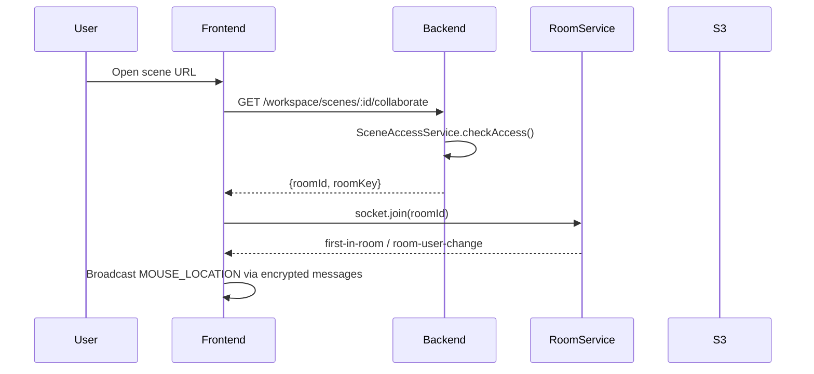
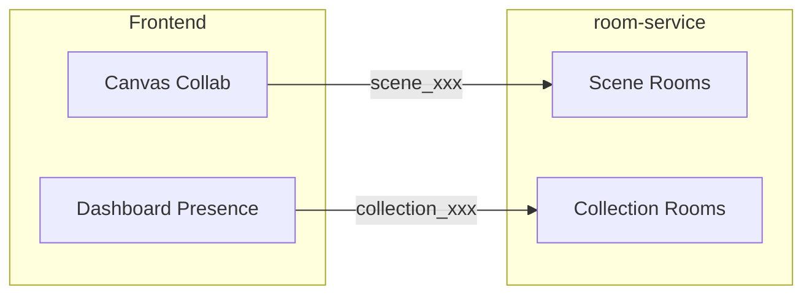
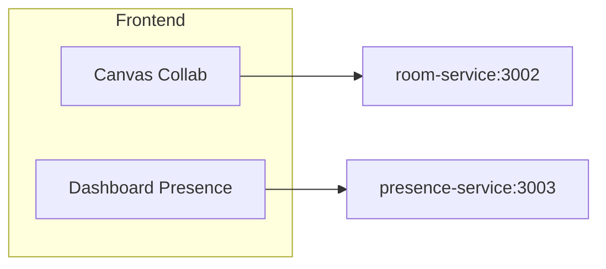
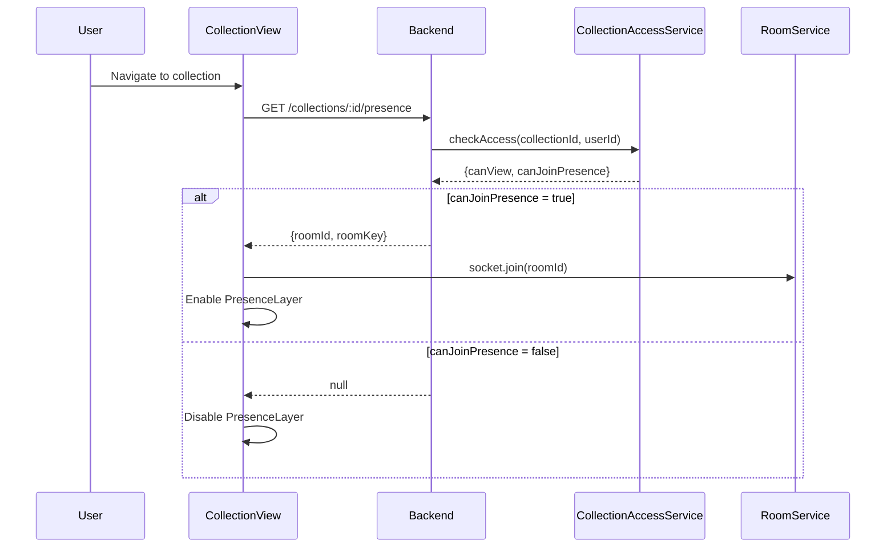

# Shared Presence Architecture for Workspace Dashboard

## Executive Summary

This plan extends AstraDraw's collaboration system to support **Collection-level presence rooms**. Users browsing a shared collection's dashboard will see ghost cursors and active avatars of other team members, similar to the canvas collaboration experience but adapted for HTML/React UI.---

## Current Architecture Analysis

### Existing Scene Collaboration Flow



**Key insight**: The current system generates `roomId` and `roomKey` per-Scene. For collections, we need a similar mechanism at the Collection level.---

## Part 1: Schema Evolution

### 1.1 Collection Model Updates

**File**: [`backend/prisma/schema.prisma`](backend/prisma/schema.prisma)Add collaboration credentials to the Collection model:

```prisma
model Collection {
  id          String   @id @default(cuid())
  name        String
  icon        String?
  color       String?
  isPrivate   Boolean  @default(false)
  userId      String
  workspaceId String
  workspace   Workspace @relation(...)
  
  // NEW: Presence room credentials
  presenceRoomId       String?   // Room ID for dashboard presence
  presenceRoomKeyEncrypted String?   // Encrypted room key
  
  scenes          Scene[]
  teamCollections TeamCollection[]
  
  createdAt   DateTime @default(now())
  updatedAt   DateTime @updatedAt
}
```

**Migration**: Create `add_collection_presence_fields` migration.

### 1.2 Why Not Reuse Scene Fields?

| Approach | Pros | Cons ||----------|------|------|| Add fields to Collection | Clean separation, independent lifecycle | New schema fields || Use workspace-level room | Simpler | Can't have per-collection presence || Virtual room IDs | No schema changes | Harder to manage keys |**Recommendation**: Add dedicated fields to Collection for clean separation and future flexibility.---

## Part 2: Presence vs Canvas - Rendering Strategy

### 2.1 The Challenge

The Excalidraw canvas uses its own rendering engine with infinite coordinate space. The dashboard is standard HTML/React with DOM elements. Ghost cursors need different rendering approaches:| Aspect | Canvas (Excalidraw) | Dashboard (HTML/React) ||--------|---------------------|------------------------|| Coordinate system | Infinite canvas with zoom/pan | Viewport-relative pixels || Rendering | Canvas 2D / WebGL | DOM elements || Cursor tracking | `excalidrawAPI.onPointerUpdate` | `document.onmousemove` || Element selection | Element IDs | Scene card hover states |

### 2.2 Dashboard Ghost Cursor Implementation

**Approach**: Create a dedicated `<PresenceLayer>` component that renders as an overlay on top of the dashboard content.

```javascript
┌─────────────────────────────────────────────────────────────┐
│  CollectionView                                              │
│  ┌───────────────────────────────────────────────────────┐  │
│  │  PresenceLayer (position: fixed, pointer-events: none) │  │
│  │  ┌─────────┐  ┌─────────┐                              │  │
│  │  │ Cursor1 │  │ Cursor2 │  (Animated SVG cursors)      │  │
│  │  └─────────┘  └─────────┘                              │  │
│  └───────────────────────────────────────────────────────┘  │
│  ┌───────────────────────────────────────────────────────┐  │
│  │  SceneCardGrid (actual content)                        │  │
│  │  ┌─────┐ ┌─────┐ ┌─────┐                              │  │
│  │  │Card │ │Card │ │Card │                              │  │
│  │  └─────┘ └─────┘ └─────┘                              │  │
│  └───────────────────────────────────────────────────────┘  │
└─────────────────────────────────────────────────────────────┘
```

**New files to create**:

- `frontend/excalidraw-app/components/Presence/PresenceLayer.tsx`
- `frontend/excalidraw-app/components/Presence/GhostCursor.tsx`
- `frontend/excalidraw-app/components/Presence/PresenceAvatars.tsx`
- `frontend/excalidraw-app/components/Presence/useCollectionPresence.ts`

### 2.3 Cursor Position Normalization

Since dashboard layouts can vary by screen size, cursor positions should be transmitted as **relative coordinates** within the collection view container:

```typescript
interface DashboardPointerPayload {
  // Relative position (0-1 range within container)
  relativeX: number;
  relativeY: number;
  // Absolute position for same-resolution peers
  absoluteX: number;
  absoluteY: number;
  // Container dimensions for scaling
  containerWidth: number;
  containerHeight: number;
  // What the user is hovering over
  hoveredSceneId: string | null;
  // User identity
  username: string;
  avatarUrl: string | null;
  userState: "active" | "idle" | "away";
}
```

---

## Part 3: Service Architecture Options

### Option A: Reuse room-service (Recommended)



**Implementation**:

- Room IDs use prefix convention: `scene_${sceneId}` vs `collection_${collectionId}`
- Same WebSocket server, same message format
- Reuse existing encryption/decryption logic
- Add new message subtypes for dashboard presence

**Pros**:

- Single WebSocket connection per client
- Reuse existing Portal/encryption code
- Simpler deployment
- Consistent message format

**Cons**:

- Room-service becomes more complex
- Scene and collection traffic share resources

### Option B: Separate Presence Service



**Implementation**:

- New lightweight service for presence only
- Simpler message format (no element sync)
- Independent scaling

**Pros**:

- Clear separation of concerns
- Lighter-weight presence messages
- Independent scaling

**Cons**:

- Two WebSocket connections per client
- Code duplication
- More complex deployment

### Recommendation

**Use Option A (Reuse room-service)** for initial implementation:

1. Lower implementation complexity
2. Single connection reduces client overhead
3. Can extract to separate service later if needed
4. Existing encryption infrastructure works immediately

---

## Part 4: Permission Consistency

### 4.1 Collection Access Service

**File**: `backend/src/collections/collection-access.service.ts` (NEW)

```typescript
export type CollectionAccessResult = {
  canView: boolean;
  canEdit: boolean;
  canJoinPresence: boolean;  // NEW
};

@Injectable()
export class CollectionAccessService {
  async checkAccess(collectionId: string, userId: string): Promise<CollectionAccessResult> {
    // 1. Check workspace membership
    // 2. Check if collection is private (owner only)
    // 3. Check team-collection access level
    // 4. Presence requires at least VIEW access
    
    const sceneAccess = /* existing logic */;
    return {
      canView: sceneAccess.canView,
      canEdit: sceneAccess.canEdit,
      canJoinPresence: sceneAccess.canView && !collection.isPrivate,
    };
  }
}
```


### 4.2 Presence Endpoint

**File**: [`backend/src/workspace/workspace-scenes.controller.ts`](backend/src/workspace/workspace-scenes.controller.ts)Add new endpoints for collection presence:

```typescript
@Post('collections/:id/presence')
async joinCollectionPresence(
  @Param('id') collectionId: string,
  @CurrentUser() user: User,
): Promise<{ roomId: string; roomKey: string }> {
  // Check collection is in a SHARED workspace
  // Check user has VIEW access to collection
  // Generate or retrieve presence room credentials
}

@Get('collections/:id/presence')
async getCollectionPresenceInfo(
  @Param('id') collectionId: string,
  @CurrentUser() user: User,
): Promise<{ roomId: string; roomKey: string } | null> {
  // Return existing presence room info if available
}
```


### 4.3 Permission Flow



---

## Part 5: Frontend Implementation

### 5.1 New Components

| Component | Purpose ||-----------|---------|| `PresenceLayer` | Overlay container for ghost cursors || `GhostCursor` | Individual cursor with name label || `PresenceAvatars` | Avatar row showing online users || `useCollectionPresence` | Hook managing presence WebSocket |

### 5.2 Integration Points

**File**: [`frontend/excalidraw-app/components/Workspace/CollectionView.tsx`](frontend/excalidraw-app/components/Workspace/CollectionView.tsx)

```typescript
export const CollectionView: React.FC<CollectionViewProps> = ({
  workspace,
  collection,
  onNewScene,
}) => {
  const { 
    collaborators, 
    isConnected, 
    broadcastPointer 
  } = useCollectionPresence(collection?.id, workspace?.type === "SHARED");

  // Track mouse movement
  const handleMouseMove = useCallback((e: React.MouseEvent) => {
    if (!isConnected) return;
    const rect = containerRef.current?.getBoundingClientRect();
    if (!rect) return;
    
    broadcastPointer({
      relativeX: (e.clientX - rect.left) / rect.width,
      relativeY: (e.clientY - rect.top) / rect.height,
      hoveredSceneId: getHoveredSceneId(e),
    });
  }, [isConnected, broadcastPointer]);

  return (
    <div 
      className="collection-view" 
      ref={containerRef}
      onMouseMove={handleMouseMove}
    >
      {/* Presence overlay */}
      <PresenceLayer collaborators={collaborators} />
      
      {/* Active users indicator */}
      <PresenceAvatars collaborators={collaborators} />
      
      {/* Existing content */}
      <header>...</header>
      <SceneCardGrid scenes={sortedScenes} ... />
    </div>
  );
};
```


### 5.3 Message Types

Extend existing WS_SUBTYPES in [`frontend/excalidraw-app/app_constants.ts`](frontend/excalidraw-app/app_constants.ts):

```typescript
export const WS_SUBTYPES = {
  // Existing
  INIT: "INIT",
  UPDATE: "UPDATE",
  MOUSE_LOCATION: "MOUSE_LOCATION",
  IDLE_STATUS: "IDLE_STATUS",
  
  // NEW: Dashboard presence
  DASHBOARD_POINTER: "DASHBOARD_POINTER",
  DASHBOARD_IDLE: "DASHBOARD_IDLE",
  DASHBOARD_SCENE_HOVER: "DASHBOARD_SCENE_HOVER",
} as const;
```

---

## Part 6: Implementation Phases

### Phase 1: Backend Foundation (1-2 days)

1. Add `presenceRoomId` and `presenceRoomKeyEncrypted` to Collection schema
2. Create migration
3. Implement `CollectionAccessService`
4. Add `/collections/:id/presence` endpoints
5. Write API tests

### Phase 2: Frontend Presence Layer (2-3 days)

1. Create `PresenceLayer`, `GhostCursor`, `PresenceAvatars` components
2. Implement `useCollectionPresence` hook
3. Add cursor position normalization logic
4. Style ghost cursors with user colors and labels

### Phase 3: Integration (1-2 days)

1. Integrate presence into `CollectionView`
2. Integrate presence into `DashboardView`
3. Add "viewing scene X" indicators
4. Handle connection/disconnection gracefully

### Phase 4: Polish and Testing (1-2 days)

1. Add idle/away state detection
2. Smooth cursor animations (CSS transitions)
3. Handle rapid scene switching
4. Performance optimization (throttle broadcasts)
5. E2E testing with multiple users

---

## Part 7: Files to Create/Modify

### Backend

| File | Action | Purpose ||------|--------|---------|| `backend/prisma/schema.prisma` | Modify | Add presence fields to Collection || `backend/src/collections/collection-access.service.ts` | Create | Permission checking for collections || `backend/src/workspace/workspace-scenes.controller.ts` | Modify | Add presence endpoints |

### Frontend

| File | Action | Purpose ||------|--------|---------|| `frontend/excalidraw-app/components/Presence/PresenceLayer.tsx` | Create | Cursor overlay || `frontend/excalidraw-app/components/Presence/GhostCursor.tsx` | Create | Individual cursor || `frontend/excalidraw-app/components/Presence/PresenceAvatars.tsx` | Create | Online users row || `frontend/excalidraw-app/components/Presence/useCollectionPresence.ts` | Create | Presence hook || `frontend/excalidraw-app/components/Presence/index.ts` | Create | Exports || `frontend/excalidraw-app/components/Workspace/CollectionView.tsx` | Modify | Add presence || `frontend/excalidraw-app/components/Workspace/DashboardView.tsx` | Modify | Add presence || `frontend/excalidraw-app/app_constants.ts` | Modify | New WS subtypes || `frontend/packages/excalidraw/locales/en.json` | Modify | Translations || `frontend/packages/excalidraw/locales/ru-RU.json` | Modify | Translations |---

## Estimated Effort

| Phase | Estimate ||-------|----------|| Phase 1: Backend Foundation | 8-12 hours || Phase 2: Frontend Presence Layer | 12-16 hours || Phase 3: Integration | 6-10 hours || Phase 4: Polish and Testing | 6-10 hours || **Total** | **32-48 hours** |---

## Open Questions for Future Consideration

1. **Persistence**: Should we show "last seen" timestamps when users go offline?
2. **Notifications**: Should users get notified when someone joins their collection?