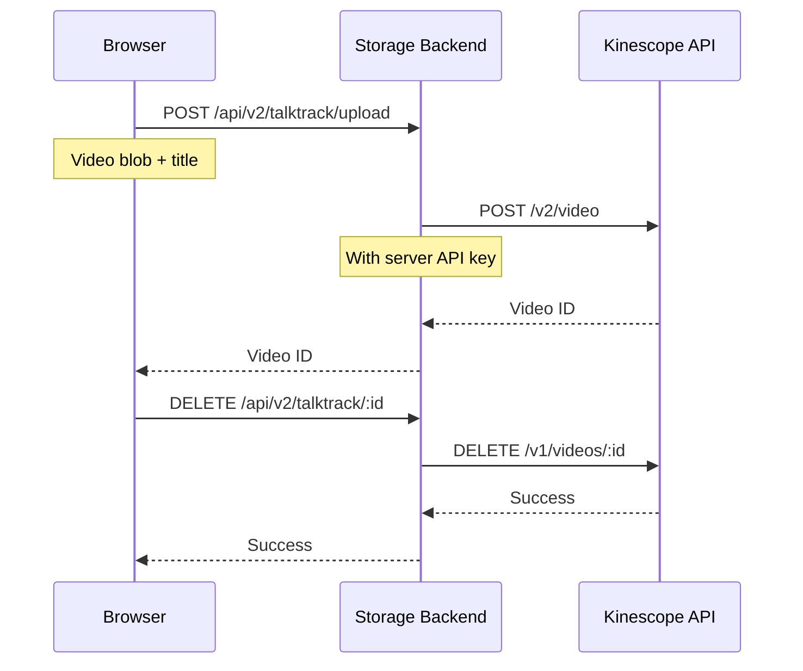

# Add Talktrack Support to Storage Backend

## Overview

Implement server-side proxy endpoints for Kinescope video uploads and deletions in the storage backend. This keeps the Kinescope API key secure on the server instead of exposing it in the browser.

## Architecture




## Implementation Steps

### 1. Add HTTP Client Dependency

**File**: [`excalidraw-storage-backend/package.json`](excalidraw-storage-backend/package.json)Add `axios` for making HTTP requests to Kinescope API:

```json
"dependencies": {
  "axios": "^1.6.0",
  // ... existing dependencies
}
```


### 2. Create Talktrack Controller

**File**: `excalidraw-storage-backend/src/talktrack/talktrack.controller.ts` (new)

```typescript
import {
  Controller,
  Post,
  Delete,
  Body,
  Param,
  Logger,
  BadRequestException,
  InternalServerErrorException,
  Headers,
} from '@nestjs/common';
import axios from 'axios';
import { getSecret } from '../utils/secrets';

@Controller('talktrack')
export class TalktrackController {
  private readonly logger = new Logger(TalktrackController.name);
  private readonly kinescopeApiKey: string;
  private readonly kinescopeProjectId: string;
  private readonly kinescopeUploadUrl = 'https://uploader.kinescope.io/v2/video';
  private readonly kinescopeApiUrl = 'https://api.kinescope.io/v1';

  constructor() {
    this.kinescopeApiKey = getSecret('KINESCOPE_API_KEY') || '';
    this.kinescopeProjectId = getSecret('KINESCOPE_PROJECT_ID') || '';
    
    if (!this.kinescopeApiKey || !this.kinescopeProjectId) {
      this.logger.warn('Kinescope API credentials not configured. Talktrack endpoints will not work.');
    }
  }

  @Post('upload')
  async upload(
    @Body() payload: Buffer,
    @Headers('x-video-title') title?: string,
  ) {
    if (!this.kinescopeApiKey || !this.kinescopeProjectId) {
      throw new InternalServerErrorException('Kinescope not configured');
    }

    const videoTitle = title || `Recording ${new Date().toISOString()}`;
    const fileName = `${videoTitle.replace(/[^a-zA-Z0-9_-]/g, '_')}.webm`;

    try {
      this.logger.log(`Uploading video: ${videoTitle}`);
      
      const response = await axios.post(this.kinescopeUploadUrl, payload, {
        headers: {
          'Authorization': `Bearer ${this.kinescopeApiKey}`,
          'X-Parent-ID': this.kinescopeProjectId,
          'X-Video-Title': videoTitle,
          'X-File-Name': fileName,
          'Content-Type': 'application/octet-stream',
        },
        maxBodyLength: Infinity,
        maxContentLength: Infinity,
      });

      const videoId = response.data?.data?.id || response.data?.id;
      
      if (!videoId) {
        throw new Error('No video ID in Kinescope response');
      }

      this.logger.log(`Video uploaded successfully: ${videoId}`);
      
      return { videoId };
    } catch (error) {
      this.logger.error(`Failed to upload video: ${error.message}`);
      throw new InternalServerErrorException('Failed to upload video to Kinescope');
    }
  }

  @Delete(':videoId')
  async delete(@Param('videoId') videoId: string) {
    if (!this.kinescopeApiKey) {
      throw new InternalServerErrorException('Kinescope not configured');
    }

    try {
      this.logger.log(`Deleting video: ${videoId}`);
      
      await axios.delete(`${this.kinescopeApiUrl}/videos/${videoId}`, {
        headers: {
          'Authorization': `Bearer ${this.kinescopeApiKey}`,
        },
      });

      this.logger.log(`Video deleted successfully: ${videoId}`);
      
      return { success: true };
    } catch (error) {
      this.logger.error(`Failed to delete video: ${error.message}`);
      throw new InternalServerErrorException('Failed to delete video from Kinescope');
    }
  }
}
```

**Key Features:**

- Reads `KINESCOPE_API_KEY` and `KINESCOPE_PROJECT_ID` using existing `getSecret()` helper (supports `_FILE` suffix)
- Proxies video upload to Kinescope with proper headers
- Proxies video deletion
- Proper error handling and logging

### 3. Update App Module

**File**: [`excalidraw-storage-backend/src/app.module.ts`](excalidraw-storage-backend/src/app.module.ts)Add the new controller:

```typescript
import { TalktrackController } from './talktrack/talktrack.controller';

@Module({
  imports: [StorageModule],
  controllers: [
    ScenesController, 
    RoomsController, 
    FilesController,
    TalktrackController, // Add this
  ],
})
export class AppModule {
  configure(consumer: MiddlewareConsumer) {
    consumer.apply(RawParserMiddleware).forRoutes('**');
  }
}
```


### 4. Update Frontend to Use Proxy

**File**: [`excalidraw/excalidraw-app/components/Talktrack/kinescopeApi.ts`](excalidraw/excalidraw-app/components/Talktrack/kinescopeApi.ts)Update to use proxy by default if storage backend URL is configured:

```typescript
export async function uploadToKinescope(
  blob: Blob,
  title: string,
  onProgress?: UploadProgressCallback,
): Promise<string> {
  const storageUrl = getStorageBackendUrl();
  
  // Use proxy if storage backend is configured, otherwise direct upload
  if (storageUrl) {
    return uploadViaProxy(blob, title, onProgress);
  }
  
  // Direct upload (existing code)
  if (!isKinescopeConfigured()) {
    throw new Error("Kinescope is not configured");
  }
  // ... rest of existing direct upload code
}
```

Update `deleteFromKinescope()`:

```typescript
export async function deleteFromKinescope(videoId: string): Promise<void> {
  const storageUrl = getStorageBackendUrl();
  
  // Use proxy if available
  if (storageUrl) {
    const response = await fetch(`${storageUrl}/talktrack/${videoId}`, {
      method: "DELETE",
    });
    
    if (!response.ok) {
      throw new Error(`Failed to delete video: ${response.status}`);
    }
    return;
  }
  
  // Direct API (existing code)
  if (!isKinescopeConfigured()) {
    throw new Error("Kinescope is not configured");
  }
  
  const response = await fetch(`https://api.kinescope.io/v1/videos/${videoId}`, {
    method: "DELETE",
    headers: {
      Authorization: `Bearer ${getKinescopeApiKey()}`,
    },
  });

  if (!response.ok) {
    throw new Error(`Failed to delete video: ${response.status}`);
  }
}
```


### 5. Update Environment Variables Documentation

**File**: [`excalidraw-storage-backend/README.md`](excalidraw-storage-backend/README.md)Add to environment variables table:

```markdown
| `KINESCOPE_API_KEY` | Kinescope API key for Talktrack | `""` | ✅ |
| `KINESCOPE_PROJECT_ID` | Kinescope project/folder ID | `""` | ✅ |
```

Add section:

````markdown
## Talktrack Configuration

To enable Talktrack video recording proxy:

```bash
# Set Kinescope credentials
KINESCOPE_API_KEY=your_api_key
KINESCOPE_PROJECT_ID=your_project_id

# Or use Docker secrets
KINESCOPE_API_KEY_FILE=/run/secrets/kinescope_api_key
KINESCOPE_PROJECT_ID_FILE=/run/secrets/kinescope_project_id
````

New endpoints:

- `POST /api/v2/talktrack/upload` - Upload video to Kinescope
- `DELETE /api/v2/talktrack/:videoId` - Delete video from Kinescope
````javascript

**File**: [`env.example`](env.example)

Add storage backend section:

```bash
# =============================================================================
# STORAGE BACKEND - KINESCOPE CONFIGURATION
# =============================================================================
# These are used by the storage backend to proxy Kinescope API calls
# This keeps API keys server-side for better security

KINESCOPE_API_KEY=your_kinescope_api_key_here
KINESCOPE_PROJECT_ID=your_project_id_here
````


### 6. Update Docker Compose

**File**: [`docker-compose.yml`](docker-compose.yml)Add environment variables to storage service:

```yaml
storage:
  environment:
    # ... existing vars
    - KINESCOPE_API_KEY=${KINESCOPE_API_KEY:-}
    - KINESCOPE_PROJECT_ID=${KINESCOPE_PROJECT_ID:-}
```


### 7. Add Tests

**File**: `excalidraw-storage-backend/src/talktrack/talktrack.controller.spec.ts` (new)Basic unit tests for the controller:

```typescript
import { Test, TestingModule } from '@nestjs/testing';
import { TalktrackController } from './talktrack.controller';

describe('TalktrackController', () => {
  let controller: TalktrackController;

  beforeEach(async () => {
    const module: TestingModule = await Test.createTestingModule({
      controllers: [TalktrackController],
    }).compile();

    controller = module.get<TalktrackController>(TalktrackController);
  });

  it('should be defined', () => {
    expect(controller).toBeDefined();
  });
});
```


## Benefits

1. **Security**: API keys never exposed to browser
2. **Rate Limiting**: Can add rate limiting at backend level
3. **Authentication**: Can add user authentication/authorization
4. **Monitoring**: Centralized logging and error handling
5. **Flexibility**: Can store recording metadata in database
6. **Backward Compatible**: Direct upload still works if storage backend URL not configured

## Deployment Notes

- Storage backend needs `KINESCOPE_API_KEY` and `KINESCOPE_PROJECT_ID` environment variables