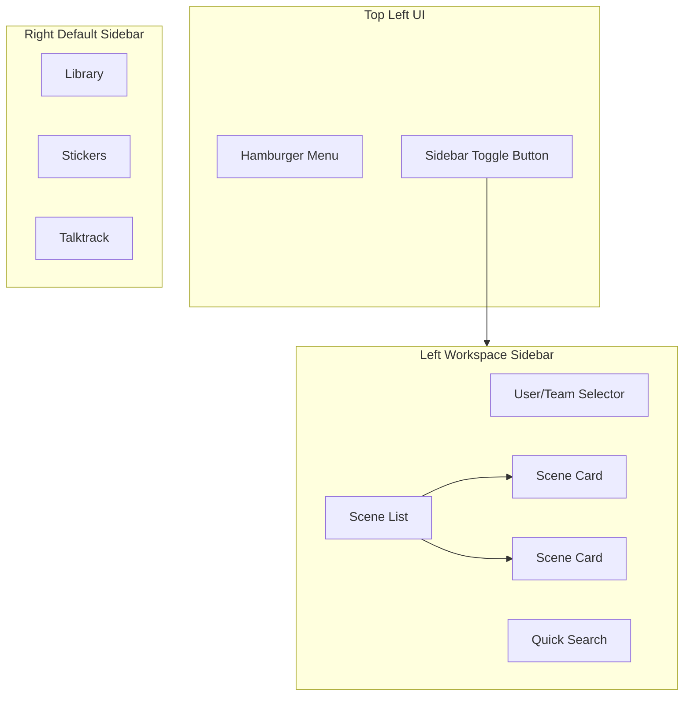

# Workspace Left Sidebar with User Sign-up/Sign-in

## Overview

Implement a dedicated left sidebar for workspace/dashboard functionality, separate from the existing right sidebar, AND full local user authentication (sign-up + sign-in) with SSO/OIDC as an optional alternative. The sidebar will include:

- Toggle button next to the hamburger menu
- User/team selector at top
- Quick search functionality
- Scene list with thumbnails, author, date
- Auto-open on login

## Part 1: User Sign-up and Sign-in System

### Database Schema Changes

Update `excalidraw-storage-backend/prisma/schema.prisma`:

```prisma
model User {
  id           String   @id @default(cuid())
  email        String   @unique
  name         String?
  avatarUrl    String?
  
  // Authentication - either OIDC or local password
  oidcId       String?  @unique  // Make optional (was required)
  passwordHash String?           // NEW: bcrypt hash for local auth
  
  createdAt    DateTime @default(now())
  updatedAt    DateTime @updatedAt

  scenes       Scene[]
  collections  Collection[]

  @@map("users")
}
```


### Backend Auth Service Changes

Update `excalidraw-storage-backend/src/auth/auth.service.ts`:

- Install bcrypt: `npm install bcrypt @types/bcrypt`
- Add `registerUser(email, password, name)` method
- Add `authenticateUser(email, password)` method (replaces admin-only logic)
- Use bcrypt for password hashing (not SHA-256)

### New API Endpoints

Update `excalidraw-storage-backend/src/auth/auth.controller.ts`:

- `POST /auth/register` - Create new local user account
- Update `POST /auth/login/local` - Login with email/password (any user, not just admin)

### Frontend Changes

Update `excalidraw/excalidraw-app/auth/authApi.ts`:

- Add `register(email, password, name)` function

Update `excalidraw/excalidraw-app/components/Workspace/LoginDialog.tsx`:

- Add sign-up form with email, password, confirm password, name fields
- Toggle between "Sign in" and "Sign up" modes
- Show SSO button only if OIDC is configured
- Validate password match, email format

## Architecture




## Key Changes

### 1. Create Left Sidebar Component

Update [excalidraw-app/components/Workspace/WorkspaceSidebar.tsx](excalidraw/excalidraw-app/components/Workspace/WorkspaceSidebar.tsx):

- Add search input with keyboard shortcut hint
- Add user avatar with team/workspace name dropdown
- Update SceneCard to show thumbnail, title, author ("by Mr. Khachaturov"), date, and private lock icon
- Add "Dashboard" and "Private" section headers
- Style to match Excalidraw+ (purple accent color, card hover states)

### 2. Add Sidebar Toggle Button

Create new component in [excalidraw-app/components/Workspace/WorkspaceSidebarTrigger.tsx](excalidraw/excalidraw-app/components/Workspace/WorkspaceSidebarTrigger.tsx):

- Icon button positioned next to hamburger menu
- Uses backtick shortcut to toggle
- Shows tooltip "Toggle sidebar - (backtick)"

### 3. Integrate with App Layout

Update [excalidraw-app/App.tsx](excalidraw/excalidraw-app/App.tsx):

- Add workspace sidebar trigger button in top-left area
- Pass `excalidrawAPI` for sidebar to access scene data
- Auto-open sidebar when user logs in
- Manage left sidebar state separate from right sidebar

### 4. Update Scene Card Design

Update [excalidraw-app/components/Workspace/SceneCard.tsx](excalidraw/excalidraw-app/components/Workspace/SceneCard.tsx):

- Display thumbnail image (or placeholder)
- Show scene title
- Show author: "by {username}"
- Show relative date: "2 days ago"
- Add private lock icon
- Hover/selected states with purple accent

### 5. Add Search Functionality

Update WorkspaceSidebar:

- Add search input at top
- Filter scenes by title as user types
- Show keyboard shortcut hint (Cmd+P)

### 6. Styling Updates

Create/update SCSS files:

- [excalidraw-app/components/Workspace/WorkspaceSidebar.scss](excalidraw/excalidraw-app/components/Workspace/WorkspaceSidebar.scss)
- [excalidraw-app/components/Workspace/SceneCard.scss](excalidraw/excalidraw-app/components/Workspace/SceneCard.scss)

Key styles:

- Left-positioned sidebar (not overlapping canvas)
- Purple accent color (#6965db) for selected states
- Proper spacing and typography
- Dark/light theme support

### 7. Auto-open on Login

In AuthContext or App.tsx:

- Detect when user becomes authenticated
- Automatically open workspace sidebar
- Save preference to localStorage

## Files to Modify

- `excalidraw-app/components/Workspace/WorkspaceSidebar.tsx` - Major refactor
- `excalidraw-app/components/Workspace/WorkspaceSidebar.scss` - Restyle
- `excalidraw-app/components/Workspace/SceneCard.tsx` - Update layout
- `excalidraw-app/components/Workspace/SceneCard.scss` - Restyle
- `excalidraw-app/App.tsx` - Add trigger button, auto-open logic
- `excalidraw-app/auth/AuthContext.tsx` - Add login detection callback

## New Files

- `excalidraw-app/components/Workspace/WorkspaceSidebarTrigger.tsx` - Toggle button component

## API Changes

Backend endpoints:

- `GET /api/v2/workspace/scenes` - List scenes
- `POST /api/v2/workspace/scenes` - Create scene
- `GET /api/v2/auth/me` - Get user info
- `POST /api/v2/auth/register` - NEW: User registration
- `POST /api/v2/auth/login/local` - Updated: Any user login (not admin-only)
- `GET /api/v2/auth/status` - Returns `{ oidcConfigured, localAuthEnabled }`

## Summary of All Changes

### Backend (excalidraw-storage-backend)

1. **Prisma Schema** - Make oidcId optional, add passwordHash
2. **Auth Service** - Add register, login with bcrypt
3. **Auth Controller** - Add /register endpoint
4. **Package.json** - Add bcrypt dependency
5. **Run migration** - Update database schema

### Frontend (excalidraw)

1. **authApi.ts** - Add register() function
2. **LoginDialog.tsx** - Sign-up form with toggle
3. **WorkspaceSidebar.tsx** - Search, sections, Excalidraw+ style
4. **SceneCard.tsx** - Thumbnail, author, date, lock icon