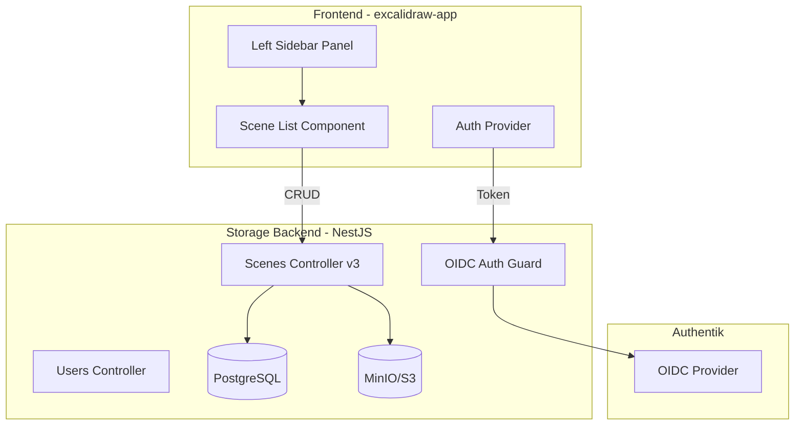

# Workspace MVP Implementation

## Architecture Overview




## Phase 1: Backend - Authentication & Database

### 1.1 Add PostgreSQL to Docker Compose

Add PostgreSQL service to `docker-compose.yml` for storing user and scene metadata.

### 1.2 OIDC Authentication in Storage Backend

Use `passport` with `passport-openidconnect` strategy in NestJS:

- Add `/auth/login` - redirects to Authentik
- Add `/auth/callback` - handles OIDC callback
- Add `/auth/me` - returns current user info
- Add JWT session management

Key files to create:

- `excalidraw-storage-backend/src/auth/auth.module.ts`
- `excalidraw-storage-backend/src/auth/oidc.strategy.ts`
- `excalidraw-storage-backend/src/auth/auth.controller.ts`
- `excalidraw-storage-backend/src/auth/jwt.guard.ts`

### 1.3 User & Scene Metadata Models

Create Prisma schema for:

- `User` - id, email, name, authentikId, createdAt
- `Scene` - id, title, userId, thumbnailUrl, roomId, createdAt, updatedAt
- Scene data (elements/files) stays in S3, metadata in PostgreSQL

## Phase 2: Backend - Scene Management API

### 2.1 New Scenes API (v3)

Extend `excalidraw-storage-backend/src/scenes/scenes.controller.ts`:

```javascript
GET    /api/v3/scenes        - List user's scenes
POST   /api/v3/scenes        - Create new scene  
GET    /api/v3/scenes/:id    - Get scene metadata
PUT    /api/v3/scenes/:id    - Update scene
DELETE /api/v3/scenes/:id    - Delete scene
```

Each scene links to:

- S3 blob (existing storage) for actual scene data
- Collaboration room (existing excalidraw-room) for real-time

## Phase 3: Frontend - Authentication

### 3.1 Auth Context & Provider

Create in `excalidraw-app/auth/`:

- `AuthContext.tsx` - React context for auth state
- `AuthProvider.tsx` - OIDC client wrapper using `oidc-client-ts`
- `useAuth.ts` - Hook for auth operations

### 3.2 Login Flow

- Check auth state on app load
- If not authenticated, show login button in welcome screen
- Redirect to Authentik, then back to app with token

## Phase 4: Frontend - Left Sidebar Workspace Panel

### 4.1 Workspace Sidebar Component

Create `excalidraw-app/components/Workspace/`:

- `WorkspaceSidebar.tsx` - Main left sidebar container
- `WorkspaceSidebar.scss` - Styles matching right sidebar
- `ScenesList.tsx` - List of user's saved scenes
- `SceneCard.tsx` - Individual scene card with thumbnail

### 4.2 Sidebar Integration

Modify `excalidraw-app/App.tsx`:

- Add WorkspaceSidebar alongside existing AppSidebar
- Position on left side (mirror of right sidebar)
- Toggle via hamburger menu or dedicated button

### 4.3 Scene Operations

- **Save Current**: Save current canvas as new scene or update existing
- **Open Scene**: Load scene from list into canvas
- **New Scene**: Create blank canvas
- **Scene Thumbnail**: Auto-generate on save (canvas snapshot)

## Environment Variables

Add to `env.example`:

```bash
# Authentik OIDC
OIDC_ISSUER_URL=https://auth.yourdomain.com/application/o/astradraw/
OIDC_CLIENT_ID=astradraw
OIDC_CLIENT_SECRET=your_secret
OIDC_REDIRECT_URI=https://draw.yourdomain.com/auth/callback

# PostgreSQL
POSTGRES_HOST=postgres
POSTGRES_PORT=5432
POSTGRES_USER=astradraw
POSTGRES_PASSWORD=your_password
POSTGRES_DB=astradraw
```


## File Structure

```javascript
excalidraw-storage-backend/
├── prisma/
│   └── schema.prisma          # New: Database schema
├── src/
│   ├── auth/                  # New: Auth module
│   │   ├── auth.module.ts
│   │   ├── auth.controller.ts
│   │   ├── oidc.strategy.ts
│   │   └── jwt.guard.ts
│   └── users/                 # New: Users module
│       ├── users.module.ts
│       └── users.service.ts

excalidraw-app/
├── auth/                      # New: Auth context
│   ├── AuthContext.tsx
│   ├── AuthProvider.tsx
│   └── useAuth.ts
└── components/
    └── Workspace/             # New: Workspace sidebar
        ├── WorkspaceSidebar.tsx
        ├── WorkspaceSidebar.scss
        ├── ScenesList.tsx
        └── SceneCard.tsx
```


## Implementation Order

1. PostgreSQL + Prisma setup in storage backend
2. OIDC auth in storage backend
3. User/Scene models and API
4. Frontend auth provider
5. Left sidebar UI