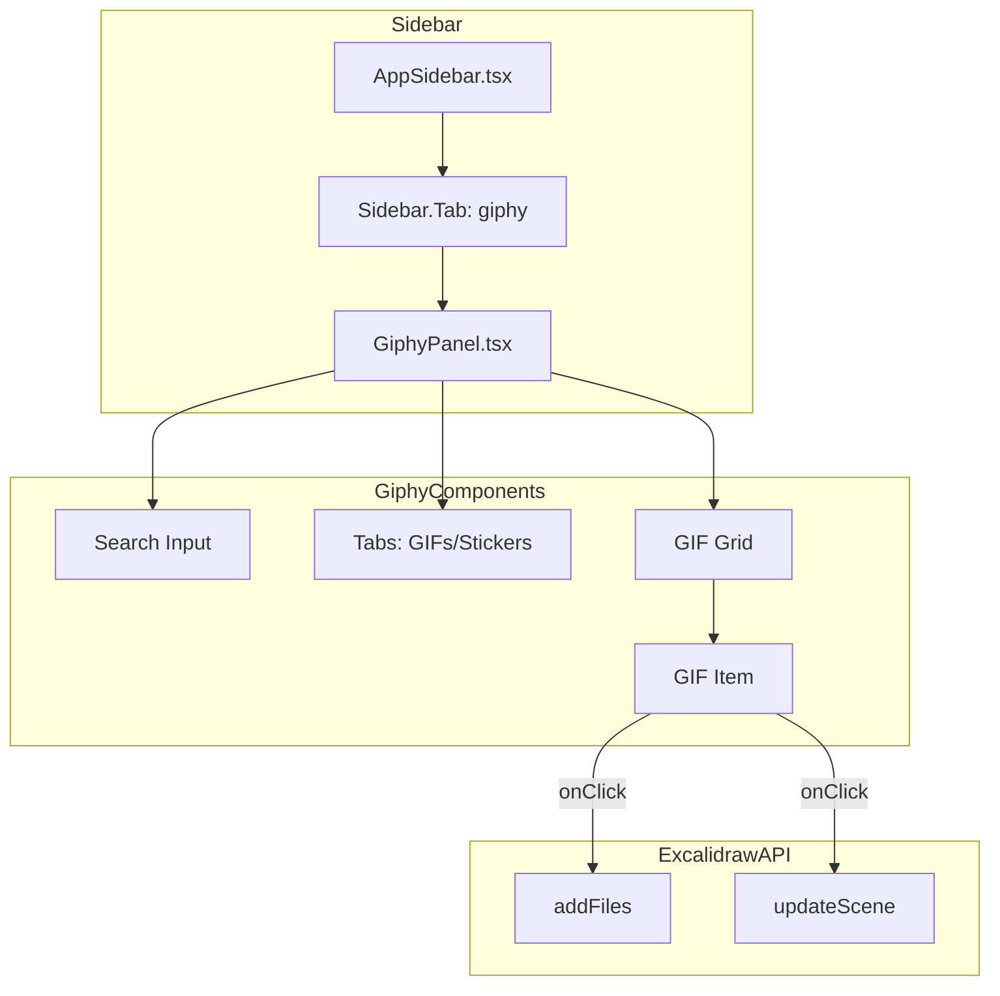

# Add GIPHY Sidebar Tab

## Overview

Add a new GIPHY tab to the AstraDraw sidebar that allows users to search for GIFs and stickers, view trending content, and insert them onto the canvas as image elements.

## Architecture




## Files to Create/Modify

### 1. New Files

- **`frontend/excalidraw-app/components/Stickers/StickersPanel.tsx`** - Main panel component with search, tabs (GIFs/Stickers), trending, and grid display
- **`frontend/excalidraw-app/components/Stickers/StickersPanel.scss`** - Styles for the panel
- **`frontend/excalidraw-app/components/Stickers/index.ts`** - Export file
- **`frontend/excalidraw-app/components/Stickers/giphyApi.ts`** - API helper functions for GIPHY fetch requests

### 2. Modified Existing Files

- **`frontend/excalidraw-app/components/AppSidebar.tsx`** - Add new Stickers tab trigger and tab content
- **`frontend/packages/excalidraw/components/icons.tsx`** - Add sticker icon
- **`frontend/packages/excalidraw/locales/en.json`** - Add English translations
- **`frontend/packages/excalidraw/locales/ru-RU.json`** - Add Russian translations

## Implementation Details

### GIPHY API Integration

Use the GIPHY Fetch API directly (no SDK needed for basic usage). API Key will be configured via environment variable:

```typescript
// Environment variable: VITE_APP_GIPHY_API_KEY
const GIPHY_API_KEY = import.meta.env.VITE_APP_GIPHY_API_KEY;
```

**To get a GIPHY API key:**

1. Go to [developers.giphy.com](https://developers.giphy.com/)
2. Create an account or sign in
3. Click "Create an App"
4. Select "API" (not SDK)
5. Copy your API key

### GiphyPanel Component Features

1. **Search bar** - Search for GIFs/stickers by keyword
2. **Content type toggle** - Switch between GIFs and Stickers
3. **Trending section** - Show trending GIFs when no search query
4. **Responsive grid** - Display GIFs in a masonry-style grid
5. **Loading states** - Show skeleton/spinner while loading
6. **Error handling** - Display error message if API fails or key missing

### Adding GIF to Canvas

When a user clicks a GIF:

1. Fetch the GIF image as a data URL (using the `fixed_width` rendition for performance)
2. Create a unique `FileId` for the image
3. Call `excalidrawAPI.addFiles()` to register the binary file
4. Call `excalidrawAPI.updateScene()` to add an image element positioned at the center of the viewport
```typescript
// Key snippet for inserting GIF
const fileId = nanoid() as FileId;
const response = await fetch(gifUrl);
const blob = await response.blob();
const dataURL = await blobToDataURL(blob);

excalidrawAPI.addFiles([{
  id: fileId,
  dataURL,
  mimeType: "image/gif",
}]);

excalidrawAPI.updateScene({
  elements: [...elements, newImageElement],
});
```


### Translations

**English (en.json):**

```json
"giphy": {
  "title": "GIPHY",
  "search": "Search GIFs...",
  "searchStickers": "Search stickers...",
  "gifs": "GIFs",
  "stickers": "Stickers",
  "trending": "Trending",
  "noResults": "No results found",
  "loading": "Loading...",
  "error": "Failed to load GIFs",
  "apiKeyMissing": "GIPHY API key is not configured",
  "poweredBy": "Powered by GIPHY"
}
```

**Russian (ru-RU.json):**

```json
"giphy": {
  "title": "GIPHY",
  "search": "Поиск GIF...",
  "searchStickers": "Поиск стикеров...",
  "gifs": "GIF",
  "stickers": "Стикеры",
  "trending": "Популярное",
  "noResults": "Ничего не найдено",
  "loading": "Загрузка...",
  "error": "Не удалось загрузить GIF",
  "apiKeyMissing": "API ключ GIPHY не настроен",
  "poweredBy": "При поддержке GIPHY"
}
```


### Icon

Add a GIF icon to `icons.tsx` using the Tabler icons style:

```typescript
export const gifIcon = createIcon(
  <g strokeWidth="1.25">
    <path stroke="none" d="M0 0h24v24H0z" fill="none" />
    <rect x="3" y="5" width="18" height="14" rx="2" />
    <path d="M7 15v-4a2 2 0 0 1 4 0v4" />
    <path d="M7 13h4" />
    <path d="M15 15v-6h2a2 2 0 1 1 0 4h-2" />
  </g>,
  tablerIconProps,
);
```


## Environment Setup

Add to `.env.development` or `.env.production`:

```javascript
VITE_APP_GIPHY_API_KEY=your_api_key_here
```


## Dependencies

No new npm packages needed - we'll use the native Fetch API to call GIPHY endpoints directly:

- Trending: `https://api.giphy.com/v1/gifs/trending`
- Search: `https://api.giphy.com/v1/gifs/search`
- Stickers trending: `https://api.giphy.com/v1/stickers/trending`


## Implementation Summary

The Stickers & GIFs sidebar tab has been implemented with:

### Files Created (`frontend/excalidraw-app/components/Stickers/`)
- `giphyApi.ts` - API helper functions (fetchTrending, searchContent, imageUrlToDataUrl)
- `StickersPanel.tsx` - Main panel with search, tabs (All/Stickers/Emojis/GIFs), masonry grid
- `StickersPanel.scss` - Styles matching GIPHY UI design
- `index.ts` - Export file

### Files Modified
- `frontend/packages/excalidraw/components/icons.tsx` - Added stickerIcon
- `frontend/packages/excalidraw/locales/en.json` - English translations
- `frontend/packages/excalidraw/locales/ru-RU.json` - Russian translations
- `frontend/excalidraw-app/components/AppSidebar.tsx` - Added Stickers tab
- `deploy/docker-compose.yml` - Added VITE_APP_GIPHY_API_KEY environment variable
- `deploy/env.example` - Documented the GIPHY API key configuration

## Usage

1. Add your GIPHY API key to `deploy/.env`:
   ```bash
   GIPHY_API_KEY=your_api_key_here
   ```

2. Rebuild and restart Docker:
   ```bash
   cd deploy
   docker compose up -d --build
   ```

The Stickers & GIFs tab appears in the sidebar. Users can browse trending content, search, and click to insert directly onto the canvas.