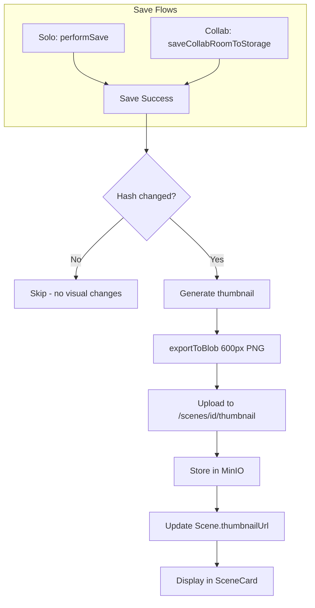

# Scene Thumbnail Previews

**Status:** ✅ Implemented  
**Date:** December 22, 2025  
**Related:** [AUTOSAVE.md](../guides/AUTOSAVE.md), [AUTO_COLLABORATION.md](AUTO_COLLABORATION.md)

---

## Overview

Scene thumbnail previews provide visual previews of canvas content in scene cards across the application. Instead of showing placeholder icons, users see actual miniature renderings of their drawings.

### Where Thumbnails Appear

| Location | Component | Description |
|----------|-----------|-------------|
| Sidebar (board mode) | `BoardModeNav` → `SceneCard` | Scene list when editing on canvas |
| Dashboard | `DashboardView` → `SceneCardGrid` | Recently modified/visited scenes |
| Collection view | `CollectionView` → `SceneCardGrid` | All scenes in a collection |

---

## Architecture

### Two Save Flows

AstraDraw has two distinct save mechanisms. Thumbnails are generated after **both**:

| Scene Type | Save Mechanism | Thumbnail Trigger |
|------------|----------------|-------------------|
| Solo (personal/private) | `performSave()` in App.tsx | After `updateSceneData()` success |
| Collab (shared collection) | `saveCollabRoomToStorage()` in Collab.tsx | After `saveToStorageBackend()` success |

### Data Flow

```
User draws → Save succeeds → Hash check → Generate PNG → Upload to MinIO → Update DB
```



---

## Implementation Details

### Shared Utility Function

Both save flows use the same utility:

```typescript
// frontend/excalidraw-app/utils/thumbnailGenerator.ts

export async function maybeGenerateAndUploadThumbnail(
  sceneId: string,
  elements: readonly ExcalidrawElement[],
  appState: Partial<AppState>,
  files: BinaryFiles
): Promise<void>
```

**Behavior:**
1. Compute lightweight hash of visual state
2. Compare with last thumbnail hash for this scene
3. If different, generate 600px PNG via `exportToBlob()`
4. Upload to backend
5. Update hash on success

**Properties:**
- **Best-effort**: Errors logged but never block saves
- **Non-blocking**: Fire-and-forget (no await in calling code)
- **Idempotent**: Same scene always overwrites `thumbnails/{sceneId}.png`

### Hash Function

Only properties that affect visual output are hashed:

```typescript
function generateSceneHash(elements, appState, files): string {
  const data = {
    elements: elements.map(e => `${e.id}:${e.version}`).join(','),
    bgColor: appState.viewBackgroundColor,
    fileIds: Object.keys(files).sort().join(','),
  };
  return simpleHash(JSON.stringify(data));
}
```

This ensures thumbnails are only regenerated when:
- Elements are added, modified, or deleted
- Background color changes
- Images are added or removed

**Not triggering regeneration:**
- Cursor movement
- Selection changes
- Zoom/pan changes
- UI state changes

### Thumbnail Generation Settings

```typescript
const thumbnail = await exportToBlob({
  elements: elements.filter(el => !el.isDeleted),
  appState: {
    ...appState,
    exportBackground: true,
    exportScale: 1,
  },
  files,
  maxWidthOrHeight: 600,  // Medium quality, ~30-80KB
  mimeType: 'image/png',
});
```

### Concurrency Handling

| Mechanism | Purpose |
|-----------|---------|
| `pendingThumbnails` Set | Prevents parallel generation for same scene |
| Idempotent key | `thumbnails/{sceneId}.png` safely overwrites |
| No queue | Next save triggers new thumbnail if hash differs |

---

## API Endpoints

### Upload Thumbnail

```
PUT /api/v2/workspace/scenes/:id/thumbnail
Content-Type: image/png
Body: <PNG blob>
```

**Response:**
```json
{
  "thumbnailUrl": "/s3/excalidraw/thumbnails/abc123.png"
}
```

**Authorization:** JWT required, must have edit access to scene

### Storage

- **Location:** MinIO bucket at `thumbnails/{sceneId}.png`
- **Namespace:** `StorageNamespace.THUMBNAILS` (added to storage interface)
- **Size limit:** 500KB max (enforced by backend)
- **Format:** PNG
- **Dimensions:** Max 600px width or height (maintains aspect ratio)

### Thumbnail URL Generation

The backend generates thumbnail URLs based on the deployment environment:

| Environment | URL Format | Example |
|-------------|------------|---------|
| **Development** | `/s3/{bucket}/thumbnails/{id}.png` | `/s3/excalidraw/thumbnails/abc123.png` |
| **Production** | `{S3_PUBLIC_URL}/{bucket}/thumbnails/{id}.png` | `https://s3.example.com/excalidraw/thumbnails/abc123.png` |

**Environment Variables:**

| Variable | Description | Example |
|----------|-------------|---------|
| `S3_PUBLIC_URL` | Public S3/CDN URL (no trailing slash) | `https://s3.example.com` |
| `S3_BUCKET` | MinIO bucket name (no leading slash) | `excalidraw` |

**URL Building Logic:**

```typescript
// Backend: workspace-scenes.controller.ts
let thumbnailUrl: string;
const s3PublicUrl = process.env.S3_PUBLIC_URL;
const bucket = (process.env.S3_BUCKET || 'excalidraw').replace(/^\//, '');

if (s3PublicUrl) {
  // Production: Direct S3/CDN URL
  thumbnailUrl = `${s3PublicUrl.replace(/\/+$/, '')}/${bucket}/thumbnails/${thumbnailKey}`;
} else {
  // Development: Traefik-proxied path
  thumbnailUrl = `/s3/${bucket}/thumbnails/${thumbnailKey}`;
}
```

**Important:**
- `S3_PUBLIC_URL` must NOT have a trailing slash
- `S3_BUCKET` must NOT have a leading slash
- In development, Traefik proxies `/s3/*` to MinIO's S3 API (port 9000)
- In production, `S3_PUBLIC_URL` should point to the same bucket as `S3_BUCKET`

### Traefik Configuration (Development)

For development, Traefik proxies thumbnail requests to MinIO:

```yaml
# docker-compose.yml - minio service labels
labels:
  - "traefik.enable=true"
  - "traefik.http.routers.minio-s3.rule=Host(`${APP_DOMAIN}`) && PathPrefix(`/s3`)"
  - "traefik.http.routers.minio-s3.entrypoints=websecure"
  - "traefik.http.routers.minio-s3.tls=true"
  - "traefik.http.services.minio-s3.loadbalancer.server.port=9000"
  - "traefik.http.middlewares.minio-s3-stripprefix.stripprefix.prefixes=/s3"
  - "traefik.http.routers.minio-s3.middlewares=minio-s3-stripprefix"
```

This allows the browser to access thumbnails at `/s3/excalidraw/thumbnails/{id}.png` which Traefik routes to `minio:9000/excalidraw/thumbnails/{id}.png`.

---

## Integration Points

### Solo Mode (App.tsx)

```typescript
// In performSave(), after successful updateSceneData()
await updateSceneData(currentSceneId, blob);

// Fire-and-forget thumbnail generation
maybeGenerateAndUploadThumbnail(
  currentSceneId,
  elements,
  appState,
  files
);
```

### Collaboration Mode (Collab.tsx)

For auto-collaboration scenes, the scene ID must be set when starting collaboration:

```typescript
// In App.tsx, when starting auto-collaboration
await collabAPI.startCollaboration({
  roomId: loaded.roomId,
  roomKey,
  isAutoCollab: true,
});
collabAPI.setSceneId(sceneId);  // Enable thumbnail generation
```

Then in `saveCollabRoomToStorage()`:

```typescript
// In saveCollabRoomToStorage(), after successful save
const result = await storageBackend.saveToStorageBackend(...);

// Fire-and-forget thumbnail generation
if (this.sceneId) {
  maybeGenerateAndUploadThumbnail(
    this.sceneId,
    syncableElements,
    this.excalidrawAPI.getAppState(),
    this.excalidrawAPI.getFiles()
  );
}
```

### Display (SceneCard.tsx)

```tsx
<div className="scene-card__thumbnail">
  {scene.thumbnailUrl ? (
    
  ) : (
    <div className="scene-card__thumbnail-placeholder">{playIcon}</div>
  )}
</div>
```

---

## Error Handling

| Scenario | Behavior |
|----------|----------|
| `exportToBlob()` fails | Log warning, skip thumbnail |
| Upload fails (network) | Log warning, skip thumbnail |
| Upload fails (auth) | Log warning, skip thumbnail |
| Scene deleted during upload | Backend returns 404, logged and ignored |

**Key principle:** Thumbnail generation is **best-effort**. Failures never:
- Block the save operation
- Show error UI to user
- Retry automatically

The next successful save will attempt thumbnail generation again if the hash still differs.

---

## Database Schema

The `Scene` model already has the `thumbnailUrl` field:

```prisma
model Scene {
  id           String   @id @default(cuid())
  title        String
  storageKey   String   @unique
  thumbnailUrl String?  // URL to MinIO thumbnail
  // ... other fields
}
```

---

## Performance Considerations

### Client-Side

| Operation | Typical Time | Notes |
|-----------|--------------|-------|
| Hash computation | <5ms | Simple string operations |
| `exportToBlob()` | 50-200ms | Depends on scene complexity |
| Upload | 100-500ms | Depends on network |

Total overhead: ~150-700ms, but **non-blocking**.

### Server-Side

- MinIO upload is fast (direct S3-compatible PUT)
- Database update is single field
- No image processing on backend

### Bandwidth

- Thumbnail size: ~30-80KB (600px PNG)
- Upload frequency: Only when visual content changes
- Hash check prevents redundant uploads

---

## Future Enhancements

These are **not** part of the current implementation:

- [ ] **Lazy generation**: Generate on first view instead of on save
- [ ] **WebP format**: Smaller file size than PNG
- [ ] **Multiple sizes**: Small (sidebar), medium (dashboard), large (hover preview)
- [ ] **Thumbnail cache headers**: CDN caching for faster loads
- [ ] **Regenerate button**: Manual trigger in scene settings
- [ ] **Batch regeneration**: Admin tool to regenerate all thumbnails

---

## UI Refresh

After a successful thumbnail upload, the scenes list is automatically refreshed using Jotai:

```typescript
// In thumbnailGenerator.ts, after successful upload
appJotaiStore.set(scenesRefreshAtom, appJotaiStore.get(scenesRefreshAtom) + 1);
```

This triggers all components subscribed to `scenesRefreshAtom` to re-fetch and display the new thumbnail.

---

## Files

| File | Purpose |
|------|---------|
| `frontend/excalidraw-app/utils/thumbnailGenerator.ts` | Shared utility: hash, generate, upload, refresh |
| `frontend/excalidraw-app/auth/workspaceApi.ts` | `uploadSceneThumbnail()` API call |
| `frontend/excalidraw-app/App.tsx` | Solo mode integration |
| `frontend/excalidraw-app/collab/Collab.tsx` | Collab mode integration + `setSceneId()` |
| `frontend/excalidraw-app/components/Workspace/SceneCard.tsx` | Display (sidebar) |
| `frontend/excalidraw-app/components/Workspace/SceneCardGrid.tsx` | Display (dashboard/collection) |
| `backend/src/workspace/workspace-scenes.controller.ts` | Upload endpoint |
| `backend/src/storage/storage.interface.ts` | `THUMBNAILS` namespace |

---

## Changelog

| Date | Change |
|------|--------|
| 2025-12-22 | Added URL generation docs: S3_PUBLIC_URL for production, Traefik proxy for dev |
| 2025-12-22 | Full implementation: backend endpoint, frontend utility, save flow integration, UI refresh |

