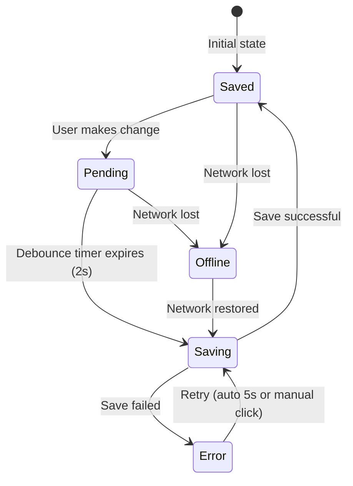

# Autosave System

AstraDraw implements a Google Docs-style autosave system with persistent status indication and offline support.

## Overview

When a user is working on a workspace scene, changes are automatically saved to the backend with visual feedback in the top-right corner of the canvas.

## Features

- **Persistent Status Indicator**: Always visible in the top-right UI area
- **Editable Scene Title**: Click to rename scenes inline
- **5 Save States**: saved, saving, pending, error, offline
- **Debounced Autosave**: 2-second debounce to avoid excessive API calls
- **Backup Save**: 30-second interval safety net
- **Error Recovery**: Auto-retry once, then manual retry on click
- **Offline Detection**: Automatically detects network status and retries on reconnect
- **beforeunload Warning**: Warns users about unsaved changes when leaving

## Save Status States

| State | Icon | Color | Description |
|-------|------|-------|-------------|
| `saved` | ✓ Checkmark | Green (#10b981) | All changes saved |
| `saving` | ◐ Spinner | Gray (#6b7280) | Currently saving to backend |
| `pending` | • Dot (pulsing) | Gray (#9ca3af) | Changes queued, waiting for debounce |
| `error` | ⚠ Warning | Amber (#f59e0b) | Save failed, click to retry |
| `offline` | 📡 Wifi-off | Red (#ef4444) | No network connection |

## State Flow



## Timing Constants

| Constant | Value | Purpose |
|----------|-------|---------|
| `AUTOSAVE_DEBOUNCE_MS` | 2000ms | Wait time after last change before saving |
| `AUTOSAVE_RETRY_DELAY_MS` | 5000ms | Delay before auto-retry on error |
| `BACKUP_SAVE_INTERVAL_MS` | 30000ms | Safety net interval for backup saves |

## UI Components

### SaveStatusIndicator

Located in `frontend/excalidraw-app/components/SaveStatusIndicator/`

**Props:**
```typescript
interface SaveStatusIndicatorProps {
  status: SaveStatus;           // Current save status
  lastSavedTime: Date | null;   // When last saved (for timestamp)
  sceneTitle: string;           // Current scene title
  onTitleChange: (newTitle: string) => Promise<void>;  // Title change handler
  onRetry: () => void;          // Manual retry handler
  isMobile?: boolean;           // Mobile layout flag
}
```

**Visual Layout:**
```
[Scene Title] • [Icon] Status Text (time on hover)
```

### Scene Title Editing

- **Click** on title to enter edit mode
- **Enter** or **blur** to save new title
- **Escape** to cancel and revert
- Title changes use separate API call (`updateSceneApi`)
- Keyboard events stop propagation to prevent Excalidraw shortcuts

## Implementation Details

### Files

| File | Purpose |
|------|---------|
| `frontend/excalidraw-app/components/SaveStatusIndicator/SaveStatusIndicator.tsx` | Main component |
| `frontend/excalidraw-app/components/SaveStatusIndicator/SaveStatusIndicator.scss` | Styles |
| `frontend/excalidraw-app/App.tsx` | State machine, autosave logic |
| `frontend/packages/excalidraw/locales/en.json` | English translations |
| `frontend/packages/excalidraw/locales/ru-RU.json` | Russian translations |

### Key Functions in App.tsx

| Function | Purpose |
|----------|---------|
| `performSave()` | Core save function, handles API call and state updates |
| `saveSceneImmediately()` | Bypasses debounce for critical saves (navigation) |
| `handleSaveRetry()` | Manual retry, resets retry count |
| `handleSceneTitleChange()` | Updates scene title via separate API |

### Autosave Flow

1. User makes a change → `onChange` callback fires
2. **Data comparison**: Current scene data is compared against `lastSavedDataRef.current`
3. If data differs → `hasUnsavedChanges` set to `true`, `saveStatus` set to `"pending"`
4. Debounce timer starts (2 seconds)
5. After debounce → `saveStatus` set to `"saving"`, API call made
6. On success → `saveStatus` set to `"saved"`, `lastSavedTime` updated, `lastSavedDataRef` updated
7. On error → `saveStatus` set to `"error"`, auto-retry scheduled (once)

### Critical Implementation Details

#### Data Comparison for Change Detection

**Problem solved:** Excalidraw's `onChange` callback fires continuously (~100+ times per second) for every render, not just actual user edits. Without proper filtering, this would cause constant "unsaved changes" status even when nothing changed.

**Solution:** Compare serialized scene data before marking as unsaved:

```typescript
const currentData = JSON.stringify({
  type: "excalidraw",
  version: 2,
  source: window.location.href,
  elements,
  appState: {
    viewBackgroundColor: appState.viewBackgroundColor,
    gridSize: appState.gridSize,
  },
  files: files,
});

// Only mark unsaved if data actually changed
if (lastSavedDataRef.current !== currentData) {
  setHasUnsavedChanges(true);
}
```

#### Scene Load Initialization

**Problem solved:** When loading an existing scene, `lastSavedDataRef` was `null`, causing the first `onChange` to incorrectly show "unsaved changes".

**Solution:** Initialize `lastSavedDataRef` with the loaded scene data immediately after loading:

```typescript
// After loading scene and calling excalidrawAPI.updateScene()
const loadedSceneData = JSON.stringify({
  type: "excalidraw",
  version: 2,
  source: window.location.href,
  elements: sceneWithCollaborators.elements || [],
  appState: {
    viewBackgroundColor: sceneWithCollaborators.appState?.viewBackgroundColor,
    gridSize: sceneWithCollaborators.appState?.gridSize,
  },
  files: sceneWithCollaborators.files || {},
});
lastSavedDataRef.current = loadedSceneData;
setHasUnsavedChanges(false);
setSaveStatus("saved");
```

### Offline Handling

```typescript
// Network event listeners
window.addEventListener("online", handleOnline);
window.addEventListener("offline", handleOffline);

// On offline: status → "offline"
// On online: if was offline with pending changes → trigger save
```

### beforeunload Warning

When user tries to leave with unsaved changes:
```typescript
if (saveStatus === "pending" || saveStatus === "saving") {
  preventUnload(event);
}
```

## Visibility Rules

The SaveStatusIndicator only appears when:
- User is authenticated
- A workspace scene is open (`currentSceneId` is set)
- Not in legacy/anonymous mode
- **Not in collaboration mode** (collaboration has its own save mechanism)

## Interaction with Collaboration

**Important:** Autosave is automatically disabled when collaboration is active.

```typescript
// In onChange callback:
if (currentSceneId && !collabAPI?.isCollaborating()) {
  // Only track unsaved changes for non-collaborative scenes
  // Collaborative scenes save via room-service
}
```

| Scene Type | Save Mechanism | Status Indicator |
|------------|----------------|------------------|
| Personal/Private scene (solo) | Workspace autosave | SaveStatusIndicator |
| Personal/Private scene (sharing) | Room-service | Collab status |
| **Shared collection scene** | **Room-service (always)** | **Collab status** |

For shared collection scenes, data is always saved to room storage (`/rooms/{roomId}`) via the collaboration system, even if you're the only person viewing the scene. See [AUTO_COLLABORATION.md](../features/AUTO_COLLABORATION.md) for details.

## Mobile Responsiveness

On mobile devices (`isMobile` flag):
- "Unsaved changes" → "Unsaved" (shorter text)
- Timestamp hidden
- Scene title truncated with ellipsis

## Translation Keys

Located in `saveStatus` namespace:

```json
{
  "saveStatus": {
    "saved": "Saved",
    "saving": "Saving...",
    "pending": "Unsaved changes",
    "pendingShort": "Unsaved",
    "error": "Save failed",
    "offline": "Offline",
    "justNow": "just now",
    "secondsAgo": "{{count}} sec ago",
    "minutesAgo": "{{count}} min ago",
    "hoursAgo": "{{count}} h ago",
    "clickToRetry": "Click to retry",
    "unsavedWarning": "You have unsaved changes...",
    "sceneTitle": "Scene title"
  }
}
```

## Accessibility

- Save status container: `role="status"`, `aria-live="polite"`
- Error state: `role="alert"` for screen reader announcement
- Title input: `aria-label` for screen readers
- Icons: `aria-hidden="true"` with text labels

## Future Improvements

- [ ] Expose `saveSceneImmediately()` via Jotai atom for navigation components
- [ ] Add save-before-navigate logic to dashboard/collection navigation
- [ ] Consider local storage fallback for offline scenarios
- [ ] Add conflict resolution for collaborative editing

---

## Changelog

| Date | Changes |
|------|---------|
| 2024-12-22 | Fixed: Status stuck on "unsaved" - added data comparison in onChange to prevent false positives |
| 2024-12-22 | Fixed: "Unsaved" shown when loading existing scene - initialize lastSavedDataRef on scene load |
| 2024-12-22 | Initial implementation with 5 states, offline detection, editable title |

